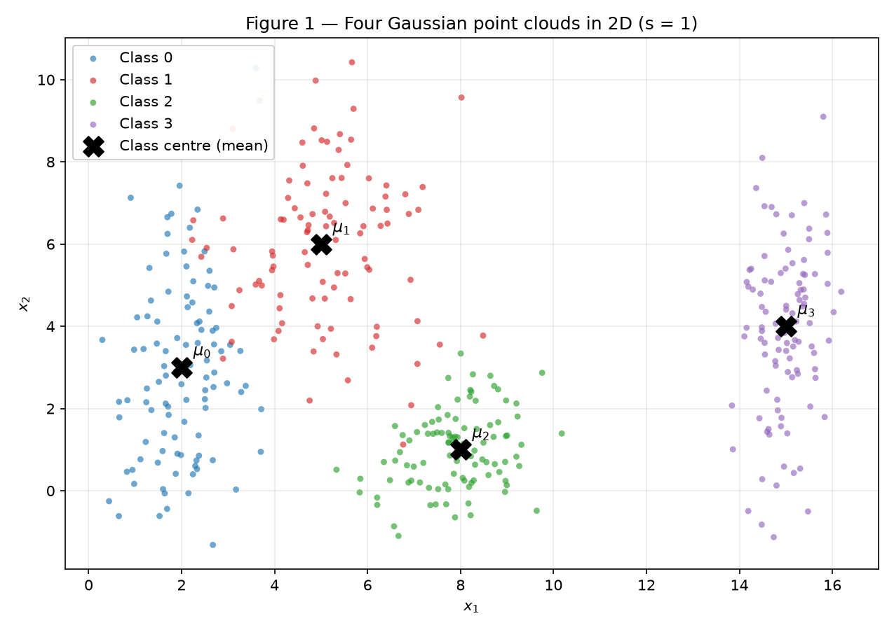
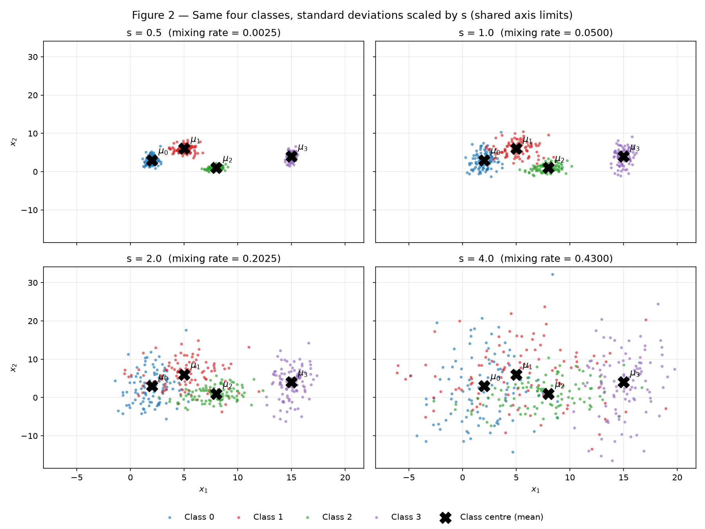
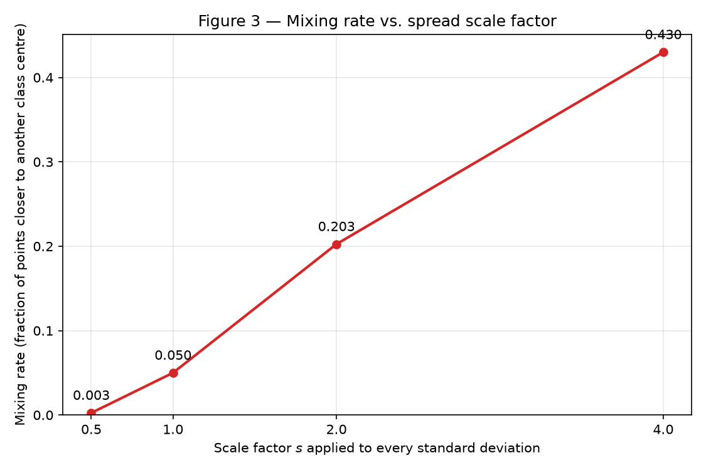
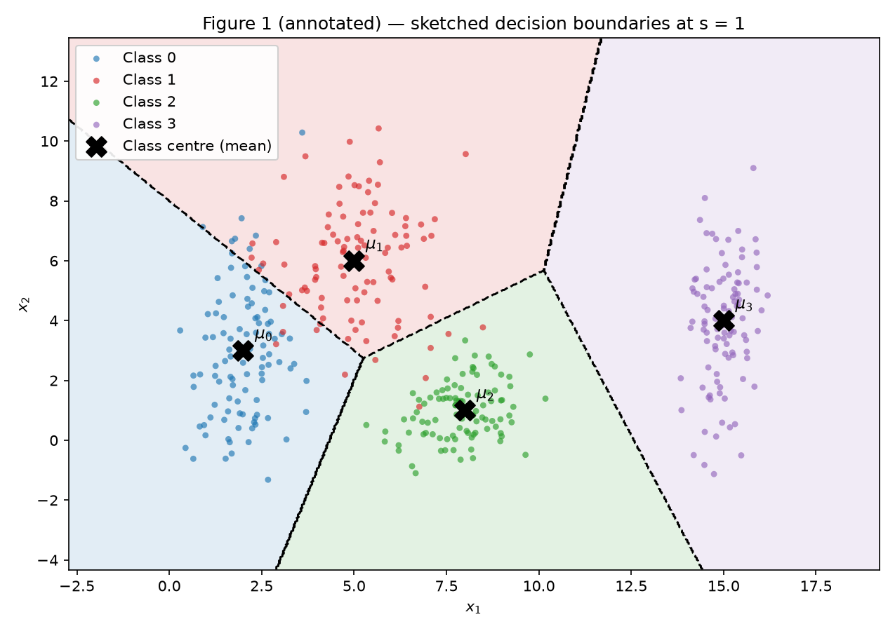
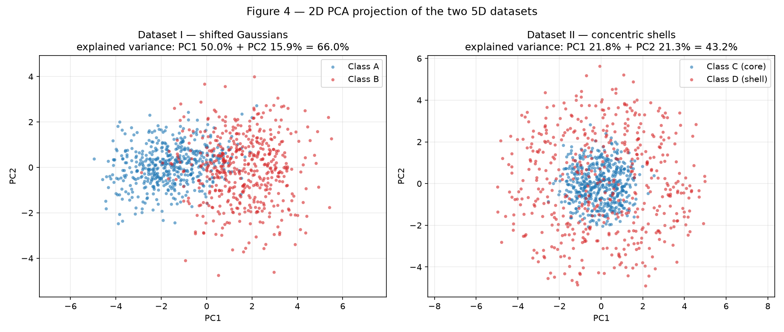
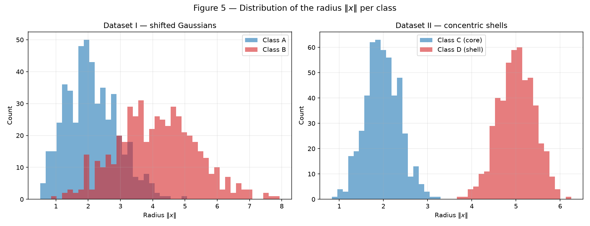
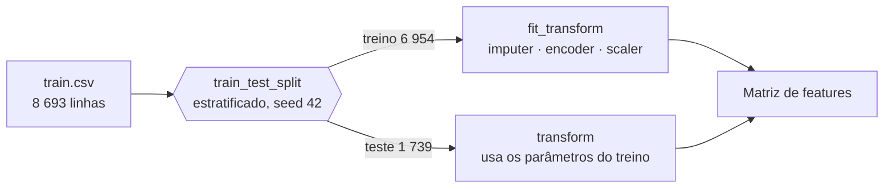
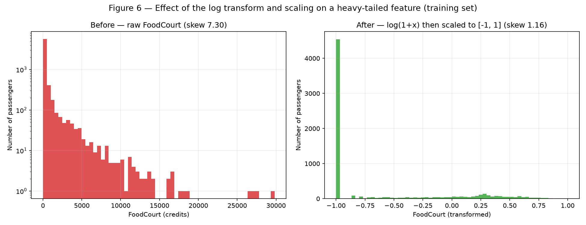

# 1. Data

!!! abstract "Enunciado"

    [Exercises → Data](https://insper.github.io/ann-dl/){:target='_blank'}

!!! info "Reprodutibilidade"

    Cada script fixa `rng = np.random.default_rng(42)` no topo e usa **esse mesmo gerador**
    do início ao fim. O Exercício 3 usa `random_state=42` no `train_test_split`. Rodando

    ```shell
    python docs/exercises/data/code/exercise1_point_clouds.py
    python docs/exercises/data/code/exercise2_nonlinearity_5d.py
    python docs/exercises/data/code/exercise3_spaceship_titanic.py
    ```

    a partir da raiz do repositório, todos os números desta página são reproduzidos e todas
    as figuras são regeradas em `figures/`. O `train.csv` do Spaceship Titanic está
    versionado em `data/train.csv`, para que os scripts rodem a partir de um clone limpo.

O fio condutor da atividade é o **espalhamento** dos dados. Os três exercícios medem a mesma
coisa por três ângulos: quanto uma nuvem se espalha (Ex. 1), em que *direção* ela se espalha
(Ex. 2) e o que fazer quando o espalhamento vem de uma cauda pesada do mundo real (Ex. 3).

---

## Exercise 1

### A — Generate the clouds

**Abordagem.** Quatro classes gaussianas em 2D, 100 amostras cada (400 no total), com médias
e desvios-padrão dados pelo enunciado. Cada coordenada é gerada de forma independente
(`mean + sigma * z`, com `z ~ N(0, I)`), ou seja, a covariância de cada classe é diagonal —
as elipses ficam alinhadas aos eixos.

| Classe | Média $\mu$ | Desvio-padrão $\sigma$ | $\bar{\sigma} = (\sigma_x + \sigma_y)/2$ |
|--------|-------------|------------------------|------------------------------------------|
| 0 | $[2, 3]$ | $[0{,}8;\ 2{,}5]$ | 1,65 |
| 1 | $[5, 6]$ | $[1{,}2;\ 1{,}9]$ | 1,55 |
| 2 | $[8, 1]$ | $[0{,}9;\ 0{,}9]$ | 0,90 |
| 3 | $[15, 4]$ | $[0{,}5;\ 2{,}0]$ | 1,25 |

Já nos parâmetros dá para prever o que a Figura 1 mostra: a classe 0 é uma elipse **alta e
estreita** ($\sigma_y = 2{,}5$ contra $\sigma_x = 0{,}8$), a classe 2 é a única
aproximadamente **circular**, e a classe 3 está isolada a $x_1 = 15$.


/// caption
**Figura 1** — As quatro nuvens no plano $(x_1, x_2)$ com $s = 1$. O `X` preto marca a média
de cada classe.
///

### B — More or less spread out

**Abordagem.** O enunciado pede as *mesmas* quatro classes em quatro espalhamentos. Para que
$s$ seja a **única** coisa que muda entre os quatro conjuntos, sorteio os desvios normais
padrão uma única vez e reescalono-os:

$$
X^{(s)}_k = \mu_k + (s \cdot \sigma_k) \odot Z_k, \qquad Z_k \sim \mathcal{N}(0, I)\ \text{fixo}
$$

Assim a nuvem em $s = 2$ é literalmente a nuvem em $s = 1$ empurrada para fora, e não uma
amostra independente que por acaso ficou mais larga. Isso isola o efeito do espalhamento e
faz o conjunto em $s = 1$ coincidir exatamente com o do item A.


/// caption
**Figura 2** — As mesmas quatro classes com todos os desvios-padrão multiplicados por
$s \in \{0{,}5;\ 1;\ 2;\ 4\}$. Os quatro painéis compartilham os limites de eixo (tirados do
conjunto mais largo, $s = 4$), então crescimento no gráfico é crescimento no dado, e não
mudança de zoom.
///

#### Separation ratio em $s = 1$

$$
r_{ij} = \frac{\lVert \mu_i - \mu_j \rVert}{\bar{\sigma}_i + \bar{\sigma}_j}, \qquad
\bar{\sigma}_k = \frac{\sigma_{k,x} + \sigma_{k,y}}{2}
$$

| Par $(i,j)$ | $\lVert \mu_i - \mu_j \rVert$ | $\bar{\sigma}_i + \bar{\sigma}_j$ | $r_{ij}$ |
|-------------|-------------------------------|-----------------------------------|----------|
| **(0, 1)** | **4,2426** | **3,2000** | **1,3258** |
| (0, 2) | 6,3246 | 2,5500 | 2,4802 |
| (0, 3) | 13,0384 | 2,9000 | 4,4960 |
| (1, 2) | 5,8310 | 2,4500 | 2,3800 |
| (1, 3) | 10,1980 | 2,8000 | 3,6422 |
| (2, 3) | 7,6158 | 2,1500 | 3,5422 |

O **menor** é o par **(0, 1)**, com $r_{01} = 1{,}3258$ — as duas classes mais próximas
($\lVert \mu_0 - \mu_1 \rVert = 4{,}24$) e, ao mesmo tempo, as duas mais espalhadas
($\bar{\sigma}_0 + \bar{\sigma}_1 = 3{,}20$, o maior denominador da tabela). O maior é (0, 3),
com $r_{03} = 4{,}50$: são as classes mais distantes entre si.

Como as médias **não mudam** com $s$, o numerador é constante e o denominador é proporcional
a $s$; logo $r_{ij}(s) = r_{ij}(1)/s$. Sem gerar nada novo:

$$
r_{01}(s = 2) = \frac{1{,}3258}{2} = \mathbf{0{,}6629}
$$

#### Taxa de mistura

Fração de pontos cujo centro de classe mais próximo **não** é o da própria classe. É uma
medida puramente geométrica — compara cada ponto contra as quatro médias verdadeiras, sem
treinar modelo nenhum. Equivale ao erro de um classificador de centroide mais próximo.

| $s$ | Taxa de mistura | Pontos mal atribuídos (de 400) | $r_{01}(s)$ |
|-----|-----------------|-------------------------------|-------------|
| 0,5 | 0,0025 | 1 | 2,6516 |
| 1,0 | 0,0500 | 20 | 1,3258 |
| 2,0 | 0,2025 | 81 | 0,6629 |
| 4,0 | 0,4300 | 172 | 0,3314 |


/// caption
**Figura 3** — Taxa de mistura $\times$ fator de escala $s$. Em termos **absolutos** o trecho
mais íngreme é o do meio (inclinação 0,153 por unidade de $s$ entre 1 e 2, contra 0,095 entre
0,5 e 1). Em termos **relativos** o começo é que é brutal: dobrar de $0{,}5$ para $1$
multiplica o erro por 20, enquanto dobrar de 2 para 4 apenas o dobra.
///

**De qual fator de escala em diante as nuvens deixam de ser separáveis por retas?**
A partir de $s = 2$. Em $s = 1$ a taxa de mistura é de 5% e a Figura 2 ainda mostra quatro
aglomerados reconhecíveis, com sobreposição confinada à fronteira entre as classes 0 e 1 —
um conjunto de retas ainda descreve bem a estrutura. Em $s = 2$ a taxa salta para **20,25%**,
e a Figura 2 mostra as classes 0, 1 e 2 formando uma mancha única no lado esquerdo: qualquer
reta que se trace ali corta o interior das três nuvens ao mesmo tempo. Em $s = 4$ (43,00%)
só a classe 3 ainda tem identidade espacial, e mesmo ela invade as demais.

**O que acontece com o menor $r_{ij}$ nesse ponto?** Ele cruza 1: $r_{01}$ cai de $1{,}3258$
para $\mathbf{0{,}6629}$. Esse limiar tem leitura direta — $r_{ij} < 1$ significa que a
distância entre os centros ficou **menor** que a soma dos espalhamentos médios das duas
classes, isto é, as nuvens se interpenetram em vez de apenas se tocarem.

Sendo preciso: $r_{01}$ cruza 1 em $s = 1{,}3258$, e a separabilidade linear *estrita* — zero
erros — já se perde bem antes, por volta de $s \approx 0{,}7$. A degradação é contínua, sem
nenhum salto em $s = 2$ nem em $s = 1{,}33$. Não existe, portanto, um valor "empírico" a
descobrir: entre os quatro valores testados, $s = 2$ é o primeiro em que $r_{\min} < 1$, e
$r_{ij} = 1$ é o critério que o próprio enunciado sugere ao perguntar o que acontece com o
menor $r_{ij}$ nesse ponto. É um critério com significado geométrico, e não uma inspeção
visual — que é o que o torna defensável.

### C — Analysis

**Sobreposição em $s = 1$.** A sobreposição não é uniforme, é concentrada em um par. As
classes 0 e 1 se tocam ao longo da diagonal entre $\mu_0 = [2,3]$ e $\mu_1 = [5,6]$ — o par de
menor $r$ (1,3258) e responsável por **14 dos 20** pontos mal atribuídos (8 da classe 0 vão
para a 1, e 6 da classe 1 vão para a 0). A classe 2 encosta na 1 pela borda inferior
($r_{12} = 2{,}38$), mas a troca é assimétrica: nenhum ponto da classe 2 é mal atribuído,
enquanto 6 pontos da classe 1 caem no território dela. A classe 3 está limpa: seu $r$ mínimo
é $3{,}54$, e nenhum ponto dela é confundido.

**Uma única fronteira linear separa todas as classes?** Não — e isso independe dos dados. Um
único hiperplano parte o plano em **dois** semiplanos, então no máximo distingue dois grupos.
Com 4 classes, o melhor que uma reta faz é separar um grupo dos demais.

**Um conjunto de fronteiras lineares?** Sim, quase perfeitamente em $s = 1$. Bastam três
retas bem colocadas (uma isolando a classe 3 à direita, uma separando a 2 abaixo, e uma entre
0 e 1). É precisamente isso que uma rede rasa faz: a fronteira **linear por partes** que
emerge da combinação de várias unidades.

Vale distinguir dois números que é fácil confundir. A taxa de mistura de 5% é o erro do
**centroide mais próximo**, não o piso de um classificador linear — retas bem posicionadas
fazem melhor que a partição de Voronoi, porque podem se deslocar na direção da classe mais
concentrada. Medido no meu próprio conjunto em $s = 1$, o melhor modelo linear multiclasse
erra **11 de 400 (2,75%)**, contra os 20 de 400 do centroide. As retas cortam o resíduo
praticamente pela metade — o que elas não fazem é zerá-lo, porque as nuvens 0 e 1 genuinamente
se interpenetram ali.


/// caption
**Figura 1 (anotada)** — Esboço das fronteiras que uma rede treinada plausivelmente
aprenderia: a partição de centro mais próximo (Voronoi) das quatro médias. É a mesma regra
que define a taxa de mistura, então as regiões coloridas explicam, ponto a ponto, quais
amostras entram nos 5% de erro em $s = 1$.
///

O esboço é a partição de Voronoi dos quatro centros — a fronteira ótima no caso idealizado em
que as classes têm espalhamento igual e isotrópico. A fronteira real que uma rede aprenderia
se afastaria dela de forma previsível: como $\sigma_0 > \sigma_2$, a fronteira honesta entre
0 e 2 seria empurrada **na direção da classe 2**, a mais concentrada, e não ficaria a meio
caminho entre os centros. Com covariâncias diagonais mas anisotrópicas, a fronteira ótima é
quadrática, e não uma reta — o que a rede aproxima por vários segmentos.

**Relação com o item B.** À medida que $s$ cresce, a região onde a rede **necessariamente**
erra cresce junto, e essa é a parte que nenhum ajuste de arquitetura resolve. Onde as
densidades das duas classes se sobrepõem existe um **erro de Bayes** irredutível: para um
ponto naquela região, a classe mais provável simplesmente não é certa.

Aqui é preciso cuidado com o que a taxa de mistura mede. Ela é o erro de um classificador
específico — o centroide mais próximo — e portanto um **limite superior** do erro de Bayes,
nunca o piso. Calculando o erro de Bayes de verdade para estas gaussianas diagonais
(densidades conhecidas, prioris iguais):

| $s$ | Taxa de mistura (centroide) | Erro de Bayes real |
|-----|------------------------------|--------------------|
| 0,5 | 0,0025 | ≈ 0,0003 |
| 1,0 | 0,0500 | ≈ 0,0301 |
| 2,0 | 0,2025 | ≈ 0,1581 |
| 4,0 | 0,4300 | ≈ 0,3331 |

O piso real vai de ~0,03% a ~33% — a mesma história de crescimento, mas a taxa de mistura
superestima o inevitável, e em $s = 4$ superestima em cerca de 10 pontos percentuais. O que é
irredutível é a coluna da direita; a diferença entre as duas colunas é exatamente o que uma
fronteira melhor que Voronoi consegue recuperar. Duas consequências práticas:

1. **Mais capacidade não ajuda.** Em $s = 4$ os centros estão nos mesmos lugares de $s = 0{,}5$;
   o que mudou foi a densidade. Uma rede maior só conseguiria decorar o ruído do conjunto de
   treino — sobreajuste, não aprendizado.
2. **A posição exata da fronteira importa cada vez menos.** Com nuvens bem separadas, deslocar
   a fronteira alguns décimos quase não muda o erro; com nuvens sobrepostas, há muitos pontos
   perto da fronteira, e ela passa a ser uma escolha de *trade-off* entre erros das duas
   classes, não uma verdade geométrica.

---

### Código — Exercício 1

``` { .python .copy .select linenums='1' title="docs/exercises/data/code/exercise1_point_clouds.py" }
--8<-- "docs/exercises/data/code/exercise1_point_clouds.py"
```

---

## Exercise 2

### A — Dataset I: shifted Gaussians

**Abordagem.** 500 amostras por classe, em $\mathbb{R}^5$, com
`rng.multivariate_normal`. As duas classes têm médias e covariâncias diferentes:
$\mu_A = [0,0,0,0,0]$ contra $\mu_B = [1{,}5]^5$, e $\Sigma_B$ tem variâncias maiores (1,5
contra 1,0) além de correlação **negativa** entre as duas primeiras features (−0,7), onde
$\Sigma_A$ tem correlação positiva (+0,8).

Ambas as matrizes são positivas definidas, o que o script confere imprimindo os autovalores
(mínimos: 0,1582 para $\Sigma_A$ e 0,4979 para $\Sigma_B$) — sem isso não existe distribuição
gaussiana correspondente.

O deslocamento das médias é a estrutura relevante aqui: as classes diferem por uma
**translação**, e translação é exatamente o tipo de diferença que um hiperplano captura.

### B — Dataset II: concentric shells

**Abordagem.** Também 500 por classe em $\mathbb{R}^5$, mas com estrutura radial: sorteio uma
direção uniforme na esfera unitária e multiplico por um raio aleatório.

A direção vem de $v \sim \mathcal{N}(0, I_5)$ normalizado, $u = v / \lVert v \rVert$. Isso
funciona porque a normal padrão multivariada é **esfericamente simétrica**: sua densidade só
depende de $\lVert v \rVert$, então normalizar dá direções uniformes na esfera. Sortear
coordenadas uniformes em um cubo e normalizar, por exemplo, concentraria as direções nas
quinas.

!!! note "Leitura de $\mathcal{N}(2{,}0;\ 0{,}4)$"

    Interpretei o segundo parâmetro dos raios como **desvio-padrão** (o `scale` do NumPy), e
    não como variância, por coerência com o Exercício 1, onde o enunciado nomeia os parâmetros
    de espalhamento como *standard deviation*. Os raios medidos confirmam a leitura: desvio
    amostral de 0,3936 (núcleo) e 0,4094 (casca).

As duas classes têm o **mesmo centro** — a origem — e diferem só pela distância a ele:
núcleo em $\rho \approx 2$, casca em $\rho \approx 5$.

### C — Visualize and compare


/// caption
**Figura 4** — Projeção PCA em 2D dos dois conjuntos. À esquerda, o Dataset I separa-se
visivelmente ao longo de PC1; à direita, o Dataset II aparece como um alvo — o núcleo azul
cercado pela casca vermelha.
///

**Variância explicada pelas duas primeiras componentes:**

| Conjunto | PC1 | PC2 | PC1 + PC2 |
|----------|-----|-----|-----------|
| Dataset I — gaussianas deslocadas | 0,5004 | 0,1593 | **0,6597** (65,97%) |
| Dataset II — cascas concêntricas | 0,2183 | 0,2132 | **0,4316** (43,16%) |

**Em qual conjunto a projeção 2D preserva melhor a informação relevante para classificação?**
No **Dataset I**, e por dois motivos que convém separar.

O primeiro é quantitativo: 65,97% contra 43,16% da variância total. No Dataset II as cinco
componentes têm variância quase idêntica (PC1 0,2183, PC2 0,2132 — perto de 1/5 = 0,20 cada),
que é a assinatura de uma nuvem **isotrópica**: não existe direção privilegiada, então
nenhuma escolha de 2 eixos entre 5 captura muito mais que 40%.

O segundo é mais importante: no Dataset I a variância retida é justamente a **útil**. O
deslocamento entre as médias é a maior fonte de variância do conjunto, então PC1 — a direção
de máxima variância — alinha-se com a direção que separa as classes, e é por isso que a
Figura 4 mostra azul à esquerda e vermelho à direita. No Dataset II a informação
discriminante não está em nenhuma direção: está no **raio**, que é uma função não linear de
todas as coordenadas. Uma projeção linear não tem como preservá-la, por melhor que seja o
alinhamento dos eixos.

**Medidas geométricas em 5D:**

| Conjunto | $\lVert \mu_1 - \mu_2 \rVert$ | Raio médio classe 1 | Raio médio classe 2 |
|----------|-------------------------------|---------------------|---------------------|
| Dataset I | **3,2282** (teórico: 3,3541) | 2,1085 (A) | 4,1284 (B) |
| Dataset II | **0,2666** | 1,9848 (C, núcleo) | 5,0047 (D, casca) |


/// caption
**Figura 5** — Distribuição do raio $\lVert x \rVert$ por classe. No Dataset I (esquerda) as
distribuições se sobrepõem largamente; no Dataset II (direita) são quase disjuntas, com
intervalos $[0{,}83;\ 3{,}22]$ e $[3{,}75;\ 6{,}25]$.
///

A tabela contém a contradição aparente que o item D pede para explicar. No Dataset II os
centros estão a **0,2666** um do outro — praticamente coincidentes, e esse resíduo é só ruído
de amostragem finita (a média de 500 direções uniformes não é exatamente zero; com $n \to
\infty$ iria a zero). Mesmo assim, os raios médios são 1,98 e 5,00, e os histogramas da
Figura 5 mal se tocam.

### D — Analysis

**Centros coincidentes com raios separados: o que isso diz sobre o hiperplano?** Diz que
nenhum hiperplano funciona, e o argumento pode ser feito sem apelar à figura. Um separador
linear decide por $f(x) = w^\top x + b$, o que equivale a projetar todos os pontos sobre a
direção $w$ e cortar essa reta em um ponto. O valor médio da projeção em cada classe é
$w^\top \mu_C$ e $w^\top \mu_D$; como $\mu_C \approx \mu_D \approx 0$, as duas projeções têm
**a mesma média**, qualquer que seja $w$. Pior: como as duas classes são esfericamente
simétricas em torno da origem, a projeção de cada uma sobre qualquer direção é simétrica em
torno de zero. As duas distribuições projetadas ficam centradas no mesmo ponto, e a casca
— que é mais larga — cobre o núcleo dos dois lados. Qualquer corte nessa reta erra pelo menos
metade de uma das duas classes: cortando à direita, perde-se metade da casca; cortando à
esquerda, perde-se boa parte do núcleo.

Convém dar o número certo aqui, porque o argumento é qualitativo e é tentador exagerá-lo. Os
estimadores lineares usuais de fato ficam perto do acaso — regressão logística e LDA marcam
0,551 neste conjunto. Mas o **melhor hiperplano possível** não fica em 50%: varrendo 20 000
direções e todos os limiares, o teto é **0,653** (e ~0,62 fora da amostra). A razão é que a
projeção da casca tem desvio $5/\sqrt{5} = 2{,}24$ contra $2/\sqrt{5} = 0{,}89$ do núcleo, e
um corte lá na cauda captura massa da casca que o núcleo não alcança. Continua sendo um
fracasso — 0,65 contra **1,00** da regra radial — mas "em torno de 50%" seria falso.

A informação, portanto, existe e é forte (Figura 5 mostra classes quase disjuntas em raio),
mas está guardada em uma estatística que a projeção linear destrói.

**Por que nenhuma quantidade de dados resolve.** Porque o obstáculo é geométrico, não
estatístico. A fronteira correta é a superfície $\lVert x \rVert = 3{,}5$, uma **hiperesfera**;
a fronteira que um separador linear produz é um **hiperplano**, e a região que ele delimita é
um semiespaço. Nenhum semiespaço é igual a uma bola: o semiespaço é ilimitado em uma direção,
a bola é limitada em todas. Mais dados estimam melhor os parâmetros de um modelo, mas não
mudam o conjunto de fronteiras que aquele modelo consegue expressar. Um perceptron com um
milhão de amostras deste conjunto continua preso ao teto de ~0,65 — e, como o conjunto não é
linearmente separável, o algoritmo do perceptron sequer converge: ele oscila indefinidamente.
É preciso mudar a **família de funções** — uma camada oculta, ou uma feature construída à mão.

**PCA é linear: uma projeção 2D embaralhada prova que as classes são inseparáveis?** Não, e
este conjunto é o contraexemplo — mas é preciso ler a Figura 4 com atenção, porque ela diz
algo mais interessante do que "embaralhado".

As classes **não** estão misturadas na Figura 4 (direita): o que se vê é um alvo, um núcleo
azul denso dentro de um anel vermelho. A projeção retém só 43,16% da variância e ainda assim
preserva estrutura visível. Quantificando no próprio plano PC1–PC2: a melhor **reta** acerta
apenas **0,651**, enquanto o melhor **círculo** centrado na origem acerta **0,882**. Ou seja,
a projeção não destruiu a informação — ela destruiu a possibilidade de usá-la *linearmente*.

Se alguém olhasse esse painel e concluísse "as classes se sobrepõem, logo são inseparáveis",
estaria **errado** por duas razões independentes: a projeção nem sequer as sobrepõe, e mesmo
que sobrepusesse isso seria evidência sobre a *projeção*, não sobre os dados. PCA maximiza
variância retida, que não é a mesma coisa que separabilidade entre classes — ele sequer olha
para os rótulos. O que a Figura 4 demonstra é que **nenhuma direção linear** separa, que é a
hipótese a testar, não a conclusão a tirar.

**Uma função simples das entradas que separa o Dataset II.** O raio ao quadrado, que é uma
soma de quadrados das coordenadas e dispensa raiz:

$$
g(x) = \sum_{i=1}^{5} x_i^2 - 12{,}25,
\qquad
\hat{y} = \begin{cases} \text{casca (D)} & \text{se } g(x) > 0 \\ \text{núcleo (C)} & \text{caso contrário} \end{cases}
$$

O limiar é o ponto médio entre os raios, $\left(\frac{2{,}0 + 5{,}0}{2}\right)^2 = 3{,}5^2 = 12{,}25$.
Medido no conjunto gerado, esse critério acerta **1,0000 — 1000 de 1000 pontos**, contra os
~50% de qualquer hiperplano.

Vale notar por que isso não contradiz o parágrafo anterior. $g$ **é** linear — mas nas
features transformadas $z_i = x_i^2$, não nas originais. É a mesma ideia de uma camada oculta:
a rede constrói internamente as features em que o problema vira linear, em vez de recebê-las
prontas. E o truque não é universal: a mesma regra radial aplicada ao Dataset I acerta apenas
**0,8110**, e ali um simples hiperplano vai melhor. A estrutura do dado é que decide qual
família de fronteiras cabe — que é a lição dos dois conjuntos juntos.

---

### Código — Exercício 2

``` { .python .copy .select linenums='1' title="docs/exercises/data/code/exercise2_nonlinearity_5d.py" }
--8<-- "docs/exercises/data/code/exercise2_nonlinearity_5d.py"
```

---

## Exercise 3

### A — Get to know the data

**Objetivo do dataset.** O Spaceship Titanic colidiu com uma anomalia no espaço-tempo e parte
dos passageiros foi transportada para outra dimensão. A coluna **`Transported`** é o alvo
binário: `True` significa que o passageiro **foi** transportado. A tarefa é prever esse
desfecho a partir dos registros de embarque — planeta de origem, hibernação, cabine, idade e
gastos a bordo.

**Balanceamento.** Praticamente perfeito, o que é raro e conveniente: dispensa reponderação
de classes ou métricas especiais, e a acurácia já é uma medida honesta.

| `Transported` | Linhas | Proporção |
|---------------|--------|-----------|
| `False` | 4 315 | 49,64% |
| `True` | 4 378 | **50,36%** |

**Features.** 8 693 linhas e 14 colunas (13 features + alvo).

| Tipo | Colunas |
|------|---------|
| Numéricas | `Age`, `RoomService`, `FoodCourt`, `ShoppingMall`, `Spa`, `VRDeck` |
| Categóricas | `HomePlanet`, `CryoSleep`, `Destination`, `VIP` |
| Identificador / texto livre | `PassengerId`, `Cabin`, `Name` |

**Valores ausentes.** Nenhuma coluna passa de 2,5%, mas os buracos estão espalhados por
quase todas — e é essa dispersão que importa: **2 087 linhas (24,01%) têm pelo menos um
ausente**. Descartar linhas incompletas custaria um quarto do dataset, o que descarta a
opção mais preguiçosa e obriga a imputar.

| Coluna | Ausentes | % |
|--------|----------|---|
| `CryoSleep` | 217 | 2,50% |
| `ShoppingMall` | 208 | 2,39% |
| `VIP` | 203 | 2,34% |
| `HomePlanet` | 201 | 2,31% |
| `Name` | 200 | 2,30% |
| `Cabin` | 199 | 2,29% |
| `VRDeck` | 188 | 2,16% |
| `Spa` | 183 | 2,11% |
| `FoodCourt` | 183 | 2,11% |
| `Destination` | 182 | 2,09% |
| `RoomService` | 181 | 2,08% |
| `Age` | 179 | 2,06% |
| `PassengerId` | 0 | 0,00% |
| `Transported` | 0 | 0,00% |

**Colunas de gasto: média, mediana e máximo.**

| Coluna | Média | Mediana | Máximo | % de zeros |
|--------|-------|---------|--------|------------|
| `RoomService` | 224,69 | 0,00 | 14 327 | 64,16% |
| `FoodCourt` | 458,08 | 0,00 | 29 813 | 62,76% |
| `ShoppingMall` | 173,73 | 0,00 | 23 492 | 64,27% |
| `Spa` | 311,14 | 0,00 | 22 408 | 61,24% |
| `VRDeck` | 304,85 | 0,00 | 24 133 | 63,21% |

**O que a diferença entre média e mediana diz?** A mediana é **zero em todas as cinco
colunas** enquanto as médias vão de 174 a 458 — a razão média/mediana é literalmente
infinita. Isso identifica a forma da distribuição sem precisar do histograma:

- **A maioria não gasta nada.** Mais de 60% dos valores são exatamente zero em cada coluna
  (boa parte são passageiros em `CryoSleep`, que por definição não consomem).
- **A cauda é longuíssima à direita.** O máximo de `FoodCourt` (29 813) equivale a **65 vezes
  a própria média** da coluna (458,08) — e a mediana, o valor realmente típico, é zero. A
  média inteira é produzida por uma minoria de grandes gastadores.
- **Média > mediana ⇒ assimetria positiva.** São distribuições de cauda pesada, não
  simétricas — a média sequer é um resumo representativo aqui, já que descreve um passageiro
  que praticamente não existe.

Consequência prática, que reaparece no item C: alimentar uma rede com `FoodCourt` cru
significa dar-lhe uma coluna cujo desvio-padrão é ditado por algumas dezenas de outliers.

### B — Split before you transform

**Abordagem.** Divisão 80/20 estratificada pelo alvo, com `random_state=42`, feita **antes**
de qualquer estatística ser calculada.

| Split | Linhas | Classe positiva |
|-------|--------|-----------------|
| Treino | 6 954 | 50,3595% |
| Teste | 1 739 | 50,3738% |

O `stratify=y` preserva a proporção original (50,36%) nos dois lados, o que evita que o
conjunto de teste tenha um balanceamento diferente por sorte do sorteio.

**Por que a divisão vem antes da imputação e do escalonamento?** Porque toda transformação
aqui é *ajustada* a partir de estatísticas do dado — a mediana que preenche `Age`, as
categorias que definem as colunas do one-hot, o mínimo e o máximo que definem a escala. Se
essas estatísticas forem calculadas sobre a tabela inteira, elas carregam informação das
linhas de teste para dentro do modelo, e o teste deixa de ser uma simulação de dado novo:
é **vazamento de dados** — mais precisamente **contaminação treino-teste**, na taxonomia vista
em aula (alvo / contaminação treino-teste / temporal / engenharia de features) — e a
performance reportada passa a ser otimista de forma não verificável. Ajustando só no treino, o
conjunto de teste ocupa o papel que deve ocupar: dado que o modelo nunca viu, nem diretamente
nem através dos parâmetros de uma transformação.

Uma ressalva de escopo: o enunciado pede 80/20, então o que chamo de "teste" aqui é o único
conjunto retido. Não há conjunto de validação, e portanto nenhuma decisão de hiperparâmetro
poderia ser tomada sem gastar o teste — o que, num projeto real com este tamanho de amostra,
pediria 60/20/20 ou validação cruzada.



### C — Preprocess

A ordem importa, e cada passo é ajustado no treino e apenas aplicado no teste.

#### 1. Missing data

| Tipo | Estratégia | Justificativa |
|------|-----------|---------------|
| Numéricas (`Age` + 5 gastos) | **Mediana** | As colunas de gasto são fortemente assimétricas: a média é puxada para cima por poucos grandes gastadores, a mediana não. Para os gastos a mediana é 0, o que coincide com o comportamento dominante (não consumir) em vez de inventar uma compra. Para `Age` dá 27 anos. |
| Categóricas (`HomePlanet`, `CryoSleep`, `Destination`, `VIP`) | **Moda** | Não existe "média" de planeta de origem. Com ~2% de ausentes, preencher com a categoria mais comum distorce pouco a distribuição. |

Valores aprendidos **no treino**: `Age` → 27,0; os cinco gastos → 0,0; `HomePlanet` → `Earth`;
`CryoSleep` → `False`; `Destination` → `TRAPPIST-1e`; `VIP` → `False`.

**Sobre o mecanismo de ausência.** A estratégia deveria seguir o mecanismo, e não apenas a
porcentagem. Tratei os ausentes como **MCAR** (completamente aleatórios), o que a uniformidade
das taxas — todas entre 2,06% e 2,50%, sem coluna destoante — torna plausível. Mas os gastos
provavelmente são **MAR**: dado `CryoSleep = True`, o gasto é zero por construção, então a
ausência é explicável por outra variável observada. É esse o argumento que transforma a
imputação condicional a `CryoSleep`, que menciono na Discussão, de palpite em escolha
principiada — e é a melhoria mais óbvia que deixei de fora.

#### 2. Feature engineering

`TotalSpend` = soma das cinco colunas de gasto, calculada **sobre os valores brutos** (antes
do log), para que continue sendo um total em créditos. No treino: média 1 426,55, mediana
715,00, máximo 35 987. Ela resume em um número o quanto o passageiro consumiu a bordo —
sinal que, no dataset, se correlaciona fortemente com não estar hibernando.

As colunas `PassengerId`, `Cabin` e `Name` foram descartadas: as duas primeiras são
identificadores e a última é texto livre; nenhuma é utilizável sem um trabalho de extração
que o enunciado não pede.

#### 3. Heavy tails

$\log(1 + x)$ aplicado às cinco colunas de gasto **e** a `TotalSpend` (mesma cauda pesada,
mesma justificativa). A escolha de $\log(1+x)$ em vez de $\log(x)$ é o que permite tratar os
zeros: $\log(1+0) = 0$, então os mais de 60% de não-gastadores permanecem em zero em vez de
virar $-\infty$.

O efeito medido em `FoodCourt` (treino): a assimetria cai de **7,30 para 1,16** e o máximo de
**29 813 para 10,30**.

!!! note "O que conta como \"antes de transformar\""

    Os valores "antes" nesta página — média **452,61**, mediana **0,00**, assimetria **7,30**,
    e o painel esquerdo da Figura 6 — são medidos no `FoodCourt` **bruto do treino, com os 154
    ausentes descartados**, não preenchidos. A imputação já é uma transformação: preencher
    aqueles 154 com a mediana (0) puxa a média de 452,61 para 442,59 e a assimetria de 7,30
    para 7,38. Reportar o número pós-imputação como "antes de transformar" seria descrever o
    resultado de um passo do pré-processamento como se fosse o dado cru — é uma diferença
    pequena em magnitude, mas de significado, e por isso o script captura a série antes do
    imputador (`raw_foodcourt_train = X_train["FoodCourt"].dropna()`).

**Por que isso ajuda uma rede com `tanh`?** Porque `tanh` **satura**. Fora de aproximadamente
$[-2, 2]$ a curva fica plana e sua derivada tende a zero; um neurônio que recebe entradas
nessa região para de propagar gradiente e efetivamente para de aprender. Sem o log, qualquer
escala razoável comprime 60% dos passageiros (os zeros) em um ponto e joga os outliers para as
extremidades achatadas — o resultado é uma coluna que quase não informa e ainda mata o
gradiente. Depois do log, os valores não nulos se distribuem por uma faixa contínua, e a
diferença entre gastar 100 e 1 000 créditos vira uma diferença que a rede consegue enxergar.
Comprimir a cauda também estabiliza o treino, já que um único outlier deixa de dominar o
gradiente de um passo.

#### 4. Categorical features

One-hot com `OneHotEncoder(handle_unknown="ignore")`, ajustado **só no treino**:

| Coluna | Categorias vistas no treino |
|--------|------------------------------|
| `HomePlanet` | `Earth`, `Europa`, `Mars` |
| `CryoSleep` | `False`, `True` |
| `Destination` | `55 Cancri e`, `PSO J318.5-22`, `TRAPPIST-1e` |
| `VIP` | `False`, `True` |

**Como o código trata uma categoria que aparece no teste mas não no treino?** O
`handle_unknown="ignore"` faz a linha desconhecida ser codificada como **zeros em todas as
colunas dummy daquela feature**, em vez de lançar exceção. Isso é o que mantém a matriz
utilizável: o número de colunas fica fixado pelo treino, e a camada de entrada da rede tem
largura constante — se o encoder criasse uma coluna nova ao ver uma categoria inédita, a
matriz de teste teria formato incompatível com os pesos já treinados. A representação
"tudo zero" é honesta: significa "nenhuma das categorias conhecidas". Neste split específico
o script verifica e reporta que **não há** categoria exclusiva do teste, mas o tratamento
está no lugar para o caso geral.

Optei por manter todas as categorias (sem `drop="first"`): a multicolinearidade que a coluna
redundante introduz é um problema para regressão linear, não para uma rede com termo de viés
e regularização.

#### 5. Scaling

**Normalização para $[-1, 1]$** com `MinMaxScaler(feature_range=(-1, 1))`, ajustada no treino.

**Por que essa e não a padronização?** Convém primeiro descartar um argumento que *não* se
sustenta nestes dados. Depois do $\log(1+x)$ as colunas de gasto ficam bem comportadas — o
maior $|z|$ entre elas vai de 2,86 (`RoomService`) a 3,06 (`ShoppingMall`), e apenas **2 de
48 678** valores da matriz padronizada passariam de $|z| = 3$. Ou seja: aqui a padronização
**não** jogaria as colunas de gasto na região plana da `tanh`, e justificar o min-max por
"salvar outliers" seria justificar com um número que os dados contradizem.

O motivo real é outro, e é de garantia, não de magnitude. A padronização não impõe limite
algum: o teto da matriz passa a depender de qual for o maior valor observado — aqui o treino
padronizado ocuparia $[-2{,}00;\ +3{,}51]$, com a `Age` chegando a $|z| = 3{,}51$. O min-max
para $[-1, 1]$ prende **todo valor de treino** ao intervalo por construção, que é exatamente
o intervalo que a própria `tanh` devolve. Isso mantém a escala da pré-ativação $Wx + b$
previsível na inicialização — e é a pré-ativação, não a feature isolada, que decide se o
neurônio começa na parte responsiva da curva.

!!! warning "Uma ressalva honesta sobre o min-max"

    O min-max centra o **intervalo**, não os **dados**. Depois de escalonadas, as cinco
    colunas de gasto têm mediana exatamente $-1$ e média em torno de $-0{,}64$, porque 63% dos
    passageiros não gastaram nada e todos eles caem no piso. Quem de fato centraria os dados
    em zero — onde a `tanh` tem inclinação máxima — é a padronização. Então a escolha é um
    troco: ganho o intervalo garantido e perco a centralização. Para uma rede com `tanh` e
    termo de viés, o viés aprende a compensar o deslocamento, e é por isso que continuo
    preferindo o intervalo garantido.

| Conjunto | Mínimo | Máximo |
|----------|--------|--------|
| Treino (colunas numéricas) | −1,0000 | 1,0000 |
| Teste (colunas numéricas) | −1,0000 | **1,1383** |

O treino fica exatamente em $[-1, 1]$ — é a definição do min-max. O teste **ultrapassa
ligeiramente**, chegando a 1,1383, e isso não é um defeito: significa que alguma linha de
teste tem um gasto maior que o maior gasto visto no treino. O scaler nunca viu esse valor, e
esse é justamente o comportamento correto — é assim que o modelo se comportaria em produção,
diante de um dado novo. **Reajustar** o scaler no teste seria vazamento, e por isso não faço.
Já *recortar* em $[-1, 1]$ usando os limites aprendidos no treino **não** seria vazamento —
usa só parâmetros do treino, e é prática comum em produção; é uma opção legítima que eu
apenas não escolhi, porque descartar a informação de que aquele passageiro gastou mais que
qualquer um do treino não me parece ganho. Um excesso de 13,8% está bem dentro da região útil
da `tanh`, então não há prejuízo prático.

As colunas one-hot ficam em $\{0, 1\}$ e não são escalonadas: já estão dentro de $[-1, 1]$ e
reescaloná-las destruiria a interpretação binária.

### D — Verify and visualize


/// caption
**Figura 6** — `FoodCourt` no conjunto de treino, antes (bruto, eixo $y$ logarítmico para que
a cauda seja visível) e depois de $\log(1+x)$ seguido de escalonamento para $[-1, 1]$. A
assimetria cai de 7,30 para 1,16.
///

A figura mostra o que os números do item C descrevem. À esquerda, praticamente toda a massa
está encostada no zero e a cauda se arrasta até 29 813 — precisei de escala logarítmica no
eixo $y$ para que as barras da cauda sequer aparecessem. À direita, o pico em $-1$ concentra
**65,3%** do treino — os passageiros que não gastaram nada, preservados exatamente em zero
pelo $\log(1+x)$, mais os 2,2 pontos percentuais de ausentes que a mediana preencheu com 0 — e
o restante se espalha por uma faixa contínua até cerca de $0{,}8$, em vez de se amontoar em um
único bin.

**Verificações finais:**

| Verificação | Resultado |
|-------------|-----------|
| NaN restantes no treino | **0** |
| NaN restantes no teste | **0** |
| Formato da matriz de treino | **(6 954, 17)** |
| Formato da matriz de teste | (1 739, 17) |
| Faixa de valores — treino | $[-1{,}0000;\ 1{,}0000]$ |
| Faixa de valores — teste | $[-1{,}0000;\ 1{,}1383]$ |
| Compatível com `tanh` | **Sim** |

As 17 features são: 7 numéricas (`Age`, os 5 gastos em log, `TotalSpend` em log) e 10 colunas
one-hot (3 `HomePlanet` + 2 `CryoSleep` + 3 `Destination` + 2 `VIP`).

Sobre a compatibilidade com `tanh`: o treino está exatamente em $[-1, 1]$ e o teste atinge no
máximo 1,1383. Ambos ficam dentro da faixa responsiva da ativação — vale lembrar que o
requisito não é que a *entrada* esteja matematicamente confinada a $[-1, 1]$ (a `tanh` aceita
qualquer real), e sim que os valores não caiam na região saturada, onde o gradiente
desaparece. Com $|x| \le 1{,}14$, a derivada da `tanh` ainda vale cerca de 0,34 do seu máximo,
longe do regime em que o treino trava.

**Qual decisão de pré-processamento mais afetaria o treino da rede?**

O par $\log(1+x)$ **+ min-max para $[-1, 1]$**, tratado como uma decisão só, porque é o que
determina se o gradiente flui. Sem o log, o escalonamento é ditado pelos outliers: dividir por
um máximo de 29 813 empurraria mais de 60% dos passageiros para exatamente $-1$ e o resto para
um punhado de valores quase indistinguíveis logo acima — as cinco colunas de gasto, que são o
sinal mais forte do dataset, virariam praticamente constantes, e os poucos pontos não
constantes cairiam na parte plana da `tanh`. Na prática a rede começaria com gradiente quase
nulo nessas entradas e demoraria muito, ou simplesmente não sairia do lugar. Com o log antes do
escalonamento, a mesma coluna passa a ocupar a faixa inteira e cada diferença de gasto vira uma
diferença de ativação utilizável.

Em segundo lugar eu colocaria a imputação dos gastos pela mediana. Ela é benigna **porque** a
mediana é 0 e coincide com o comportamento dominante; se eu tivesse usado a média (~200–450),
teria inventado consumo para ~2% dos passageiros, e consumo é justamente o que distingue quem
estava hibernando. Seria uma decisão de aparência inofensiva corrompendo a feature mais
informativa — o tipo de erro que não aparece em nenhuma verificação de NaN ou de formato.

---

### Código — Exercício 3

``` { .python .copy .select linenums='1' title="docs/exercises/data/code/exercise3_spaceship_titanic.py" }
--8<-- "docs/exercises/data/code/exercise3_spaceship_titanic.py"
```

---

## Results summary

| # | Item | Your value |
|---|------|------------|
| 1 | Mixing rate at $s = 0.5$ | **0,0025** (1 de 400 pontos) |
| 2 | Mixing rate at $s = 1.0$ | **0,0500** (20 de 400 pontos) |
| 3 | Mixing rate at $s = 2.0$ | **0,2025** (81 de 400 pontos) |
| 4 | Mixing rate at $s = 4.0$ | **0,4300** (172 de 400 pontos) |
| 5 | Smallest $r_{ij}$ at $s = 1.0$, and which pair | **1,3258** — par **(0, 1)** |
| 6 | Distance between centers — Dataset I | **3,2282** (teórico 3,3541) |
| 7 | Distance between centers — Dataset II | **0,2666** |
| 8 | Explained variance PC1 + PC2 — Dataset I | **0,6597** (65,97%) |
| 9 | Explained variance PC1 + PC2 — Dataset II | **0,4316** (43,16%) |
| 10 | Share of the positive class in `Transported` | **50,36%** (4 378 de 8 693) |
| 11 | Mean and median of `FoodCourt` on the training set, before transforming | média **452,61** · mediana **0,00** |
| 12 | Final shape of the training feature matrix | **(6 954, 17)** |
| 13 | Minimum and maximum of the training and test sets after scaling | treino $[-1{,}0000;\ 1{,}0000]$ · teste $[-1{,}0000;\ 1{,}1383]$ |

## Discussão

**O que foi difícil.** Escolher o critério para "deixar de ser separável por retas" no
Exercício 1. Olhar a Figura 2 e decidir no olho é arbitrário; o que resolveu foi perceber que
$r_{ij} = 1$ tem significado geométrico próprio — distância entre centros igual à soma dos
espalhamentos — e que $r_{01}$ cruza esse limiar exatamente entre $s = 1$ e $s = 2$, o mesmo
intervalo em que a taxa de mistura quadruplica. Duas medidas independentes apontando para o
mesmo lugar é um argumento; uma inspeção visual não é.

**Onde a intuição falhou.** No Dataset II, duas vezes. Primeiro, meu reflexo ao ver a projeção
PCA foi "esse conjunto é difícil", quando na verdade ele é *trivial* — 100% de acurácia com
uma soma de quadrados. O erro foi tratar uma projeção linear como se fosse uma visão neutra
dos dados. Segundo, e mais sutil: eu tinha escrito que a Figura 4 mostrava as classes
"misturadas", e ao conferir percebi que ela não mostra nada disso — mostra um alvo, e um
círculo nesse plano já acerta 88,2%. O que a projeção destrói não é a informação, é a
possibilidade de usá-la com uma reta. Confundir "não separável linearmente" com "embaralhado"
é exatamente o erro que o item D pede para não cometer, e eu o cometi na primeira redação.
Também me surpreendeu que os centros ficassem a 0,2666 em vez de 0: bastou lembrar que 500
direções aleatórias não se cancelam perfeitamente.

**O que eu faria diferente.** Investigaria `Cabin` em vez de descartá-la. Ela tem a forma
`deck/num/side` e se decompõe em três features aproveitáveis (o deck, em particular, se
relaciona com `HomePlanet`). Descartei por seguir o enunciado, mas é a informação mais
promissora que ficou na mesa. Também testaria imputar os gastos condicionalmente a
`CryoSleep` — para quem está hibernando, zero não é um chute, é uma certeza.

## Conclusão

Os três exercícios contam a mesma história em escalas diferentes: **a dificuldade de um
problema de classificação não está no número de features nem no volume de dados, e sim na
geometria das distribuições**.

O Exercício 1 mostra que a dificuldade é contínua e mensurável antes de qualquer treino — as
médias nunca mudaram, só o espalhamento, e o erro de Bayes irredutível foi de ~0,03% a ~33%
(com a taxa de mistura subindo de 0,25% a 43% junto). O
Exercício 2 mostra que ela também é **qualitativa**: dois conjuntos com a mesma dimensão e o
mesmo tamanho exigem famílias de fronteiras diferentes, e nenhum volume de dados converte um
hiperplano em uma hiperesfera. O Exercício 3 mostra que, em dados reais, o espalhamento chega
disfarçado de cauda pesada, e que a preparação — log, escala, imputação — decide se o gradiente
chega a fluir.

A ligação com o resto do curso é essa: a arquitetura da rede é uma resposta a uma pergunta
sobre a forma dos dados. Vale a pena fazer a pergunta primeiro, com medidas simples como
$r_{ij}$, a distância entre centros e o histograma do raio, antes de escolher a resposta.
