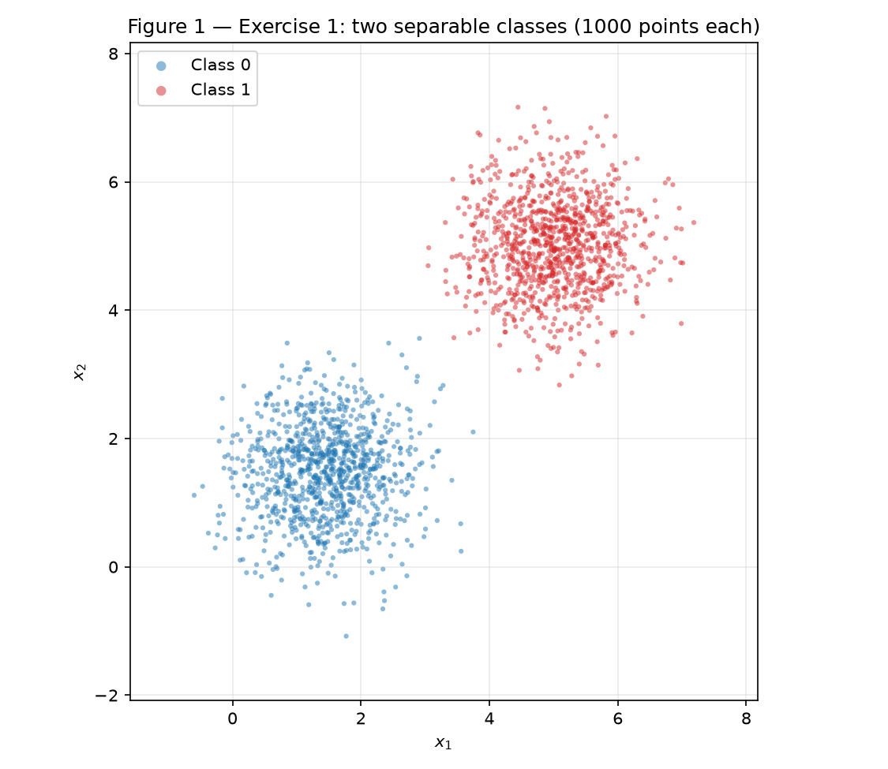
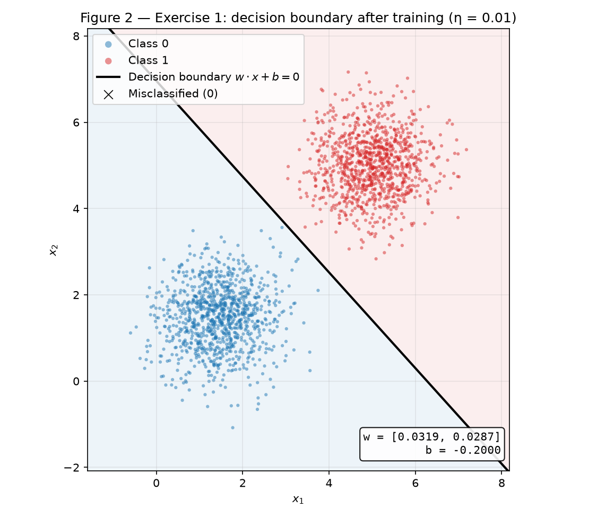
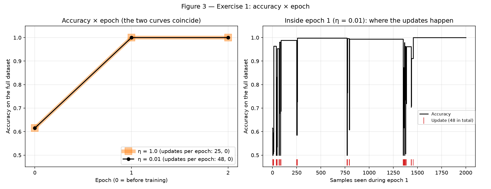
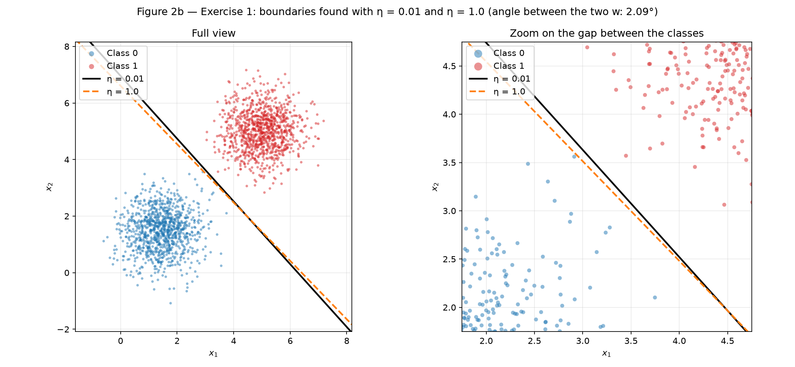
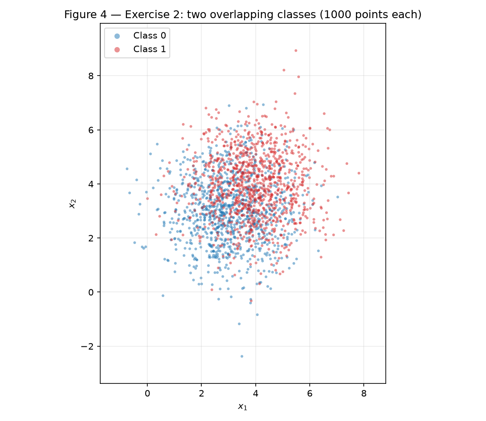
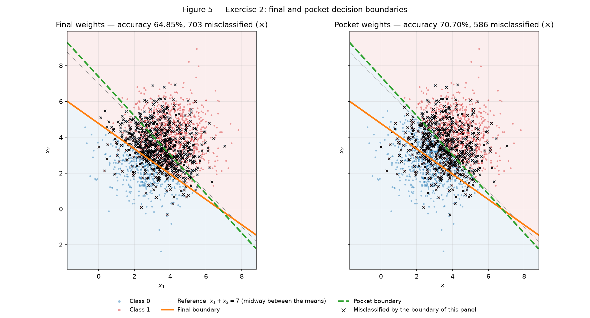
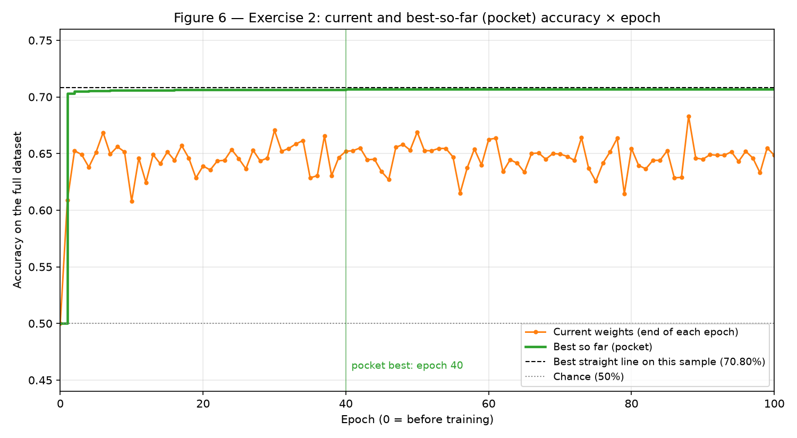
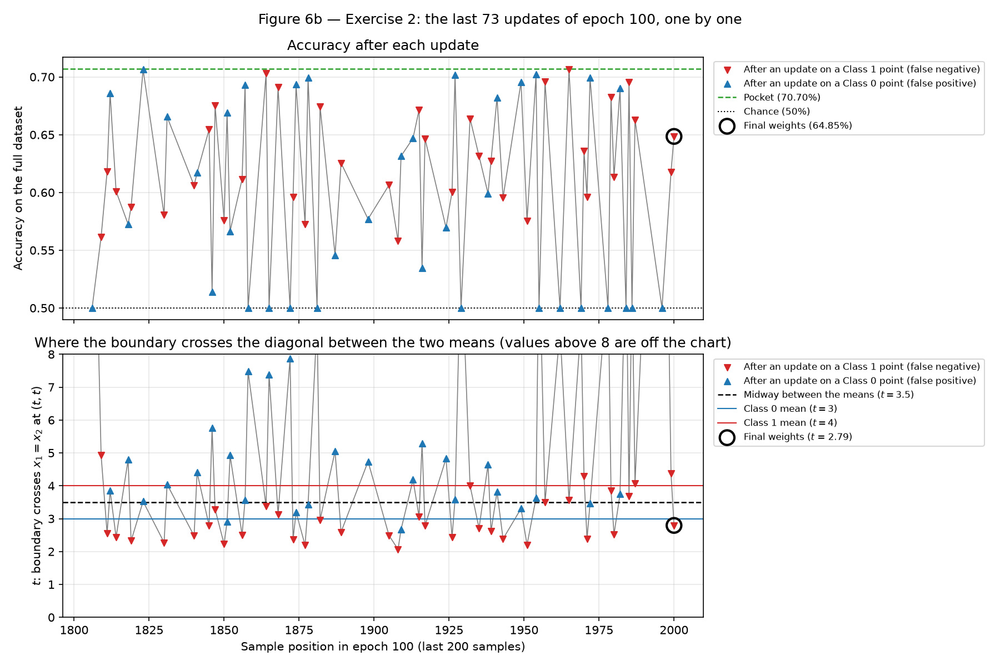

# 2. Perceptron

!!! abstract "Enunciado"

    [Exercises → Perceptron](https://insper.github.io/ann-dl/){:target='_blank'}

!!! info "Reprodutibilidade"

    Um único gerador, `rng = np.random.default_rng(42)`, criado uma vez no topo de
    `exercises.py`, produz **todos** os sorteios da atividade, sempre na mesma ordem: dados do
    Ex. 1 → ordem de apresentação do Ex. 1 → pesos iniciais do Ex. 1 → dados do Ex. 2 → ordem
    de apresentação do Ex. 2 → pesos iniciais do Ex. 2. Rodando

    ```shell
    python docs/exercises/perceptron/code/exercises.py
    ```

    a partir da raiz do repositório (cerca de 20 s), todos os números desta página são
    impressos e todas as figuras são regeradas em `figures/`. Os números foram obtidos com
    NumPy 2.5.3 e Matplotlib 3.11.2; o NumPy não garante a mesma sequência de um `Generator`
    entre versões diferentes, então é com essas versões que eles se reproduzem exatamente. A
    única amostragem além dos dois exercícios — 40 amostras novas usadas como referência no
    Ex. 2, item A — é sorteada **por último**, e não altera nenhum outro número.

O fio condutor da atividade é a **separabilidade**. O mesmo perceptron, sem mudar uma linha, é
treinado em um conjunto que ele foi feito para resolver (Ex. 1) e em outro que ele não tem como
resolver (Ex. 2). O interessante não é que o segundo falhe, e sim *como* falha: a regra de
atualização que resolve o Ex. 1 em uma época é a mesma que, no Ex. 2, nunca para de mexer na
fronteira.

---

## Abordagem de implementação

O código está dividido em dois arquivos, ambos em `code/`:

| Arquivo | Conteúdo |
|---------|----------|
| `perceptron.py` | Só o modelo: a ativação `step`, e a classe `Perceptron` com `predict`, `accuracy` e o laço de treino `fit`. Apenas NumPy. Não sorteia nada — os pesos iniciais vêm de fora. |
| `exercises.py` | O gerador `rng`, a geração dos dois conjuntos, os treinos, as Figuras 1–6 (e as auxiliares 2b e 6b) e a impressão de todo número citado aqui. |

Quatro decisões de implementação que afetam os resultados:

| Decisão | Escolha | Por quê |
|---------|---------|---------|
| Ordem de apresentação | Embaralhada **uma vez**, ao gerar os dados, e fixa em todas as épocas e em todas as execuções | Na ordem de geração (1000 pontos da classe 0, depois 1000 da classe 1) o estado ao fim de cada época reflete só o último bloco, e o Ex. 1 leva **33 épocas** em vez de 2. Fixar a ordem é o que torna literal o "mudando só $\eta$" do item D e faz a prova do caso $\mathbf{w} = \mathbf{0}$ valer exatamente. |
| Pesos iniciais | Sorteados em `exercises.py` e passados ao construtor | As execuções com $\eta = 0{,}01$ e $\eta = 1{,}0$ partem do **mesmo** $\mathbf{w}$. |
| Pocket | Sempre ativo dentro de `fit` | O Ex. 2 reusa a classe **sem alteração**. No Ex. 1 o pocket termina igual aos pesos finais, porque o final já acerta 100%. |
| Registro | Acurácia no conjunto completo ao fim de cada época (época 0 = antes de treinar) **e** depois de cada atualização | As Figuras 3, 6 e 6b, e as medidas de posição da fronteira do Ex. 2. |

Para ter uma régua no Ex. 2, o script também procura **a melhor reta** sobre a amostra por força
bruta: 3600 direções (grade de 0,1°) e, para cada uma, todos os limiares. Isso não treina modelo
nenhum — é só uma contagem — e serve para conferir o "≈ 73%" que o enunciado anuncia. Por ser uma
busca em grade, o valor é o melhor *encontrado*; uma busca mais fina só poderia igualá-lo ou
superá-lo.

---

## Exercise 1

### A — Generate the data

**Abordagem.** Duas gaussianas 2D geradas com `rng.multivariate_normal`, 1000 pontos por classe,
e depois embaralhadas uma única vez.

| Classe | Média pedida | Média amostral | Variâncias amostrais (pedido: 0,5) | Covariância cruzada (pedido: 0) |
|--------|--------------|----------------|------------------------------------|---------------------------------|
| 0 | $[1{,}5;\ 1{,}5]$ | $[1{,}4495;\ 1{,}4725]$ | 0,4914 · 0,5130 | 0,0285 |
| 1 | $[5;\ 5]$ | $[5{,}0102;\ 5{,}0126]$ | 0,4947 · 0,4990 | 0,0100 |

Os parâmetros amostrais batem com os pedidos. A separação era previsível antes de gerar: a
distância entre as médias é $3{,}5\sqrt{2} = 4{,}95$, e o desvio-padrão de cada classe na direção
que liga as médias é $\sqrt{0{,}5} = 0{,}71$. O ponto médio fica a $3{,}5$ desvios de cada média,
o que dá $P(Z > 3{,}5) = 0{,}023\%$ de chance por ponto de cair do lado errado da mediatriz
$x_1 + x_2 = 6{,}5$ — da ordem de **meio ponto esperado** (0,47) entre 2000. Com esta semente não
caiu nenhum: 0 pontos do lado errado. Além disso, a época sem erros do item C certifica que o
conjunto gerado é linearmente separável: os pesos finais *são* uma reta que separa tudo.

``` { .python .copy .select linenums='1' title="docs/exercises/perceptron/code/exercises.py — geração dos dados" }
--8<-- "docs/exercises/perceptron/code/exercises.py:data"
```


/// caption
**Figura 1** — Os 2000 pontos do Exercício 1, uma cor por classe. As duas nuvens circulares
estão separadas por uma faixa larga e vazia ao longo da diagonal.
///

### B — Implement the perceptron

**Abordagem.** Um perceptron de uma camada, escrito uma vez como classe e reusado nos dois
exercícios.

- **Predição.** $\hat{y} = \text{step}(\mathbf{w} \cdot \mathbf{x} + b)$, com
  $\text{step}(z) = 1$ se $z \geq 0$ e $0$ caso contrário (`step` usa `np.where(z >= 0, 1, 0)`,
  então o empate $z = 0$ vai para a classe 1, como pede o enunciado).
- **Atualização.** Para cada amostra, $e = y - \hat{y}$ e
  $$
  \mathbf{w} \leftarrow \mathbf{w} + \eta\, e\, \mathbf{x}, \qquad b \leftarrow b + \eta\, e .
  $$
  Com rótulos $\{0, 1\}$, $e$ vale $0$ num acerto (nenhuma atualização), $+1$ num **falso
  negativo** ($y = 1$, $\hat{y} = 0$: a fronteira precisa avançar sobre o ponto) e $-1$ num
  **falso positivo** ($y = 0$, $\hat{y} = 1$). A forma de livro-texto
  $\mathbf{w} \leftarrow \mathbf{w} + \eta\, y\, \mathbf{x}$ pressupõe rótulos $\pm 1$: aqui ela
  nunca atualizaria em um ponto da classe 0 (pois $y = 0$) e o perceptron não conseguiria
  corrigir um falso positivo.
- **Inicialização.** $\mathbf{w}$ = `rng.normal(0, 0.01, size=2)` e $b = 0$. Neste exercício,
  $\mathbf{w}_0 = [0{,}0099;\ -0{,}0083]$, com $\lVert \mathbf{w}_0 \rVert = 0{,}0129$.
- **Taxa de aprendizado.** $\eta = 0{,}01$.
- **Parada.** O laço termina quando uma época inteira passa sem nenhuma atualização, ou ao fim de
  100 épocas. A acurácia sobre o conjunto completo é registrada ao fim de cada época.

As linhas destacadas são as do pocket (usadas no Exercício 2): a inicialização do "bolso" com os
pesos iniciais e a cópia de $(\mathbf{w}, b)$ sempre que uma atualização supera a melhor acurácia
já vista. Elas não alteram a trajetória do treino — só guardam uma cópia —, e por isso a mesma
classe serve aos dois exercícios.

``` { .python .copy .select linenums='1' hl_lines="59-64 86-92" title="docs/exercises/perceptron/code/perceptron.py" }
--8<-- "docs/exercises/perceptron/code/perceptron.py"
```

### C — Train and measure

**Resultado com $\eta = 0{,}01$:**

| Quantidade | Valor |
|------------|-------|
| $\mathbf{w}$ final | $[0{,}0319;\ 0{,}0287]$ (exato: $[0{,}031891;\ 0{,}028736]$) |
| $b$ final | $-0{,}2000$ |
| Épocas | **2** — 48 atualizações na 1ª e **0** na 2ª, a época limpa que encerra o treino |
| Acurácia final | **100%** (2000 de 2000) |
| Acurácia por época | 61,50% (antes de treinar) → 100% → 100% |

O viés conta a história das atualizações: $b = \eta\,(\#\text{FN} - \#\text{FP}) =
0{,}01\,(14 - 34) = -0{,}20$. Foram **34 falsos positivos** e só **14 falsos negativos**
porque o $\mathbf{w}_0$ sorteado define uma reta pela origem, $0{,}0099\,x_1 - 0{,}0083\,x_2 = 0$,
que deixa **587 dos 1000** pontos da classe 0 do lado "classe 1" (e 183 dos 1000 da classe 1 do
lado "classe 0") — daí os $(413 + 817)/2000 = 61{,}50\%$ iniciais e a maioria das correções serem
falsos positivos, empurrando a fronteira para longe da classe 0.

``` { .python .copy .select linenums='1' title="docs/exercises/perceptron/code/exercises.py — Exercício 1" }
--8<-- "docs/exercises/perceptron/code/exercises.py:ex1"
```


/// caption
**Figura 2** — A fronteira $\mathbf{w} \cdot \mathbf{x} + b = 0$ após o treino com
$\eta = 0{,}01$, com cada semiplano tingido pela classe que prevê. Nenhum ponto mal
classificado (a legenda registra o 0).
///

A reta separa tudo, mas não está centrada na faixa vazia: passa a **0,112** do ponto mais
próximo da classe 0 e a **0,292** do ponto mais próximo da classe 1. É o comportamento esperado —
o perceptron para na *primeira* reta que não comete erros, e não procura a de maior margem.


/// caption
**Figura 3** — À esquerda, acurácia $\times$ época para $\eta = 0{,}01$ (preto) e, para o item D,
$\eta = 1{,}0$ (faixa laranja por baixo): as duas curvas coincidem, e a legenda traz as
atualizações por época de cada uma. À direita, um zoom *dentro* da época 1 com $\eta = 0{,}01$: a
acurácia no conjunto completo depois de cada uma das 48 atualizações, com a posição de cada
atualização marcada em vermelho.
///

### D — Analysis

**1. Por que dados separáveis convergem rápido?** Porque a regra só atualiza quando erra
($e = 0 \Rightarrow$ nenhuma mudança), e cada atualização empurra a fronteira na direção de
acertar o ponto que a provocou: num falso negativo, o novo valor de $\mathbf{w} \cdot \mathbf{x} + b$
naquele ponto sobe exatamente $\eta\,(\lVert \mathbf{x} \rVert^2 + 1)$; num falso positivo, desce
o mesmo tanto. Uma correção pode estragar outros pontos, mas com dados separáveis isso não se
sustenta: existe uma reta separadora $\mathbf{w}^*$, e cada atualização aumenta o alinhamento de
$\mathbf{w}$ com ela em *pelo menos* uma quantidade fixa ($\eta\gamma$), enquanto
$\lVert \mathbf{w} \rVert^2$ cresce *no máximo* uma quantidade fixa ($\eta^2 R^2$). As duas contas
só são compatíveis por um número **finito** de erros — é o teorema de convergência, enunciado no
item D.2 do Exercício 2. Os erros acabam, o número de
atualizações por época cai a **zero**, os pesos param, e a primeira época limpa encerra o laço.
Aqui a sequência foi **48 → 0**.

A Figura 3 (direita) mostra que isso acontece ainda *dentro* da primeira época: 24 das 48
atualizações ocorrem nas primeiras 250 amostras, e a última na amostra 1457; as 543 amostras
seguintes já não geram nenhuma. A melhora não é monotônica: 16 das 48 atualizações *pioraram* a
acurácia, e 8 estados intermediários ficaram em exatamente 50%. É o tamanho do passo: com
$\lVert \mathbf{w}_0 \rVert = 0{,}013$ e $\eta\,\lVert \mathbf{x} \rVert$ em média de 0,022
(classe 0) e 0,071 (classe 1), uma única correção pode passar do ponto e jogar a fronteira para o
outro lado das nuvens. Mesmo assim o processo converge, porque o que garante a convergência não
é o passo ser pequeno, e sim a **separabilidade**. E ela é folgada aqui: com as médias a 7 desvios
uma da outra, a faixa vazia é larga, há muitas retas com zero erros, e o perceptron esbarra numa
delas logo na primeira passada.

**2. $\eta = 1{,}0$, mudando nada além disso** (mesmos dados, mesma ordem, mesmo
$\mathbf{w}_0$):

| | $\eta = 0{,}01$ | $\eta = 1{,}0$ |
|---|---|---|
| Épocas | 2 (48 atualizações, depois 0) | **2** (25 atualizações, depois 0) |
| Acurácia final | 100% | **100%** |
| $\mathbf{w}$, $b$ | $[0{,}0319;\ 0{,}0287]$, $-0{,}20$ | $[1{,}7173;\ 1{,}6646]$, $-11{,}0$ |
| Direção $\mathbf{w}/\lVert\mathbf{w}\rVert$ | $[0{,}7429;\ 0{,}6694]$ | $[0{,}7181;\ 0{,}6960]$ |
| Distância da fronteira à origem, $-b/\lVert\mathbf{w}\rVert$ | 4,659 | 4,599 |
| $\lVert \mathbf{w}_0 \rVert / \lVert \mathbf{w} \rVert$ final | **30,1%** | **0,54%** |

As duas execuções chegam a 100%, mas por fronteiras diferentes: as direções diferem em
**2,09°** e as retas se cruzam dentro da faixa vazia (Figura 2b).


/// caption
**Figura 2b** — As duas fronteiras sobre os mesmos dados. À direita, o zoom na faixa entre as
classes mostra que ambas separam tudo, com inclinação e posição diferentes.
///

**O que $\eta$ controla.** Não a velocidade em si: as duas convergem nas mesmas 2 épocas, e mesmo a
diferença no número de atualizações (48 × 25) vem do mecanismo abaixo. Depois de $T$ atualizações,

$$
\mathbf{w}_T = \mathbf{w}_0 + \eta \sum_{t=1}^{T} e_t\, \mathbf{x}_t
\quad\Longrightarrow\quad
\frac{\mathbf{w}_T}{\eta} = \frac{\mathbf{w}_0}{\eta} + \sum_{t=1}^{T} e_t\, \mathbf{x}_t ,
$$

e a fronteira só depende da *direção* de $(\mathbf{w}, b)$, não da escala. Então a única coisa
que $\eta$ decide é **o peso da inicialização aleatória frente às atualizações vindas dos dados**,
medido por $\lVert \mathbf{w}_0 \rVert / \eta$. Com $\eta = 0{,}01$ essa razão é $1{,}29$ — da
ordem de um ponto de dado ($\lVert \mathbf{x} \rVert$ entre ≈ 2 e ≈ 7), e ao fim do treino
$\lVert \mathbf{w}_0 \rVert$ ainda equivale a 30% de $\lVert \mathbf{w} \rVert$: o sorteio inicial
influencia quais pontos são errados e, portanto, qual reta sai. Com $\eta = 1{,}0$ a razão é
$0{,}013$ e $\mathbf{w}_0$ não muda nenhuma decisão. A execução com $\eta = 1{,}0$ é, na prática,
o **começo do zero**: ela comete exatamente as mesmas 25 atualizações, nas mesmas amostras, da
execução com $\mathbf{w} = \mathbf{0}$ — os pesos finais das duas diferem exatamente por
$\mathbf{w}_0$ — e termina a **0,31°** dela, enquanto a de $\eta = 0{,}01$ termina a 2,39°,
depois de 48 atualizações.

Isso contraria a intuição usual de que um $\eta$ grande "dá passos grandes demais" e um pequeno
"aprende devagar". Essa intuição vale quando existe uma escala fixa com que comparar o passo —
os pesos iniciais, ou uma perda suave como na descida de gradiente. No perceptron, a única escala
é $\mathbf{w}_0$; a partir do zero não há escala nenhuma, que é o item 3.

**3. Começando de $\mathbf{w} = \mathbf{0}$, $b = 0$: $\eta$ não tem efeito algum.** Sejam duas
execuções completas com $\eta_1$ e $\eta_2$, sobre a mesma sequência de amostras, e
$c = \eta_2 / \eta_1 > 0$. **Afirmação:** depois de cada amostra processada,

$$
\left(\mathbf{w}^{(2)}_t,\ b^{(2)}_t\right) = c \left(\mathbf{w}^{(1)}_t,\ b^{(1)}_t\right).
$$

*Base.* Em $t = 0$ as duas são $(\mathbf{0}, 0)$, e $\mathbf{0} = c \cdot \mathbf{0}$.

*Passo.* Suponha a igualdade válida em $t$ e seja $\mathbf{x}$ a próxima amostra. Então
$z^{(2)} = \mathbf{w}^{(2)}_t \cdot \mathbf{x} + b^{(2)}_t = c\, z^{(1)}$. Como $c > 0$,
multiplicar por $c$ preserva o sinal e leva $0$ em $0$; logo
$\text{step}(c\, z) = \text{step}(z)$, as duas predições são iguais e o erro $e = y - \hat{y}$ é
o mesmo. A atualização dá

$$
\begin{aligned}
\mathbf{w}^{(2)}_{t+1} &= c\, \mathbf{w}^{(1)}_t + \eta_2\, e\, \mathbf{x}
= c\left(\mathbf{w}^{(1)}_t + \eta_1\, e\, \mathbf{x}\right) = c\, \mathbf{w}^{(1)}_{t+1}, \\
b^{(2)}_{t+1} &= c\, b^{(1)}_t + \eta_2\, e = c\left(b^{(1)}_t + \eta_1\, e\right) = c\, b^{(1)}_{t+1}.
\qquad \blacksquare
\end{aligned}
$$

Consequências: as duas execuções fazem as **mesmas predições em todo passo**, logo erram nos
mesmos pontos, fazem o mesmo número de atualizações por época e param na **mesma época**. E a
fronteira $\{\mathbf{x} : \mathbf{w} \cdot \mathbf{x} + b = 0\}$ não muda quando
$(\mathbf{w}, b)$ é multiplicado por $c \neq 0$: continua sendo **a mesma reta**. Em forma fechada,
$\mathbf{w}_T = \eta \sum_t e_t \mathbf{x}_t$ e $b_T = \eta \sum_t e_t$, com os $e_t$ independentes
de $\eta$: $\eta$ fatora para fora de tudo.

O script confere numericamente: do zero, $\eta = 0{,}01$ dá
$\mathbf{w} = [0{,}017074;\ 0{,}016729]$, $b = -0{,}11$, e $\eta = 1{,}0$ dá
$\mathbf{w} = [1{,}7074;\ 1{,}6729]$, $b = -11{,}0$ — razão **exatamente 100** em cada componente
e no viés, 25 atualizações nas **mesmas posições** e 2 épocas nas duas. É por isso que o item B
proíbe o começo do zero: com ele, a pergunta do item 2 seria vazia, porque $\eta$ não mudaria
nada.

---

## Exercise 2

### A — Generate the data

**Abordagem.** A mesma função do Exercício 1, com os novos parâmetros, sorteada do mesmo `rng`
(continuando a sequência depois do Ex. 1).

| Classe | Média pedida | Média amostral | Variâncias amostrais (pedido: 1,5) | Covariância cruzada (pedido: 0) |
|--------|--------------|----------------|------------------------------------|---------------------------------|
| 0 | $[3;\ 3]$ | $[3{,}0717;\ 3{,}0186]$ | 1,4724 · 1,6065 | 0,0155 |
| 1 | $[4;\ 4]$ | $[3{,}9549;\ 3{,}9547]$ | 1,4545 · 1,5816 | −0,0058 |

Agora a distância entre as médias é $\sqrt{2} = 1{,}41$ e o desvio de cada classe é
$\sqrt{1{,}5} = 1{,}22$: as médias estão a só $1{,}15$ desvio uma da outra. Para duas gaussianas
com a mesma covariância isotrópica, a melhor fronteira é a mediatriz $x_1 + x_2 = 7$, e a
acurácia máxima que *qualquer* classificador atinge na população é

$$
\Phi\!\left(\frac{\lVert \mu_1 - \mu_0 \rVert}{2\sigma}\right)
= \Phi\!\left(\frac{\sqrt{2}}{2\sqrt{1{,}5}}\right) = \Phi(0{,}577) = \mathbf{71{,}81\%} .
$$

Nesta amostra, a melhor reta encontrada pela varredura acerta **70,80%** (1416 de 2000) — erra
584 pontos. O "≈ 73%" do enunciado é coerente com isso: a melhor reta escolhida *na própria
amostra* é otimista em relação ao ótimo populacional, porque se ajusta ao ruído daquela amostra.
Em 40 amostras novas com os mesmos parâmetros, ela ficou em **72,45%** em média (desvio 0,87
ponto percentual, de 70,70% a 74,20%; 30% delas chegaram a 73%). Esta semente caiu no lado baixo.

Que **nenhuma** reta separa as classes não depende da varredura. O ponto da classe 0 em
$(3{,}989;\ 3{,}975)$ está dentro do triângulo formado pelos pontos da classe 1 em
$(4{,}816;\ 3{,}972)$, $(3{,}739;\ 4{,}406)$ e $(3{,}800;\ 3{,}637)$. Um semiplano é convexo: se uma
reta deixasse os três vértices do lado "classe 1", deixaria o triângulo inteiro — e aquele ponto
da classe 0 — do mesmo lado. Logo o conjunto **não é linearmente separável**.


/// caption
**Figura 4** — Os 2000 pontos do Exercício 2. As duas nuvens se sobrepõem na maior parte da
área: não há faixa vazia, e nenhuma reta separa as cores.
///

### B — Train, keeping the best weights

**Abordagem.** A classe do Exercício 1, **sem alteração**: mesmo $\eta = 0{,}01$, mesmo limite de
100 épocas, pesos iniciais novos do mesmo `rng`,
$\mathbf{w}_0 = [-0{,}0146;\ -0{,}0046]$ ($b = 0$). O pocket é o trecho destacado no código do
item B do Exercício 1 — a cópia de $(\mathbf{w}, b)$ sempre que uma atualização produz uma
acurácia, no conjunto completo, maior que qualquer outra já vista. Ele já estava lá; aqui ele
passa a importar.

``` { .python .copy .select linenums='1' title="docs/exercises/perceptron/code/exercises.py — Exercício 2" }
--8<-- "docs/exercises/perceptron/code/exercises.py:ex2"
```

O laço rodou as **100 épocas** sem nunca ter uma época limpa (entre 739 e 822 atualizações por
época, mediana 765; 76 620 no total).

| Pesos | $\mathbf{w}$ | $b$ | Acurácia |
|-------|--------------|-----|----------|
| **Finais** (após a época 100) | $[0{,}0682;\ 0{,}0965]$ | $-0{,}4600$ | **64,85%** (1297 de 2000) |
| **Pocket** (melhor já visto) | $[0{,}0709;\ 0{,}0650]$ | $-0{,}4800$ | **70,70%** (1414 de 2000) |

O pocket foi guardado pela última vez na **época 40** (atualização 30 008 de 76 620) e fica a
**2 acertos** (0,1 ponto percentual) da melhor reta encontrada nesta amostra (70,80%). A mesma
acurácia de 70,70% reaparece nas épocas 49, 67, 71, 81 e 97, mas o pocket só troca de pesos
quando uma atualização *supera* a melhor já vista, então fica com os da época 40. Os pesos
finais ficam 5,85 pontos percentuais abaixo dele.

!!! note "O enunciado antecipa pesos finais perto de 50%; aqui deram 64,85%"

    Os dois resultados são o mesmo fenômeno visto em momentos diferentes — e a diferença vem da
    ordem de apresentação. Com os mesmos pontos na **ordem de geração** (1000 da classe 0, depois
    1000 da classe 1), a mesma classe termina com **50,05%**. O item D explica por que as duas
    coisas acontecem.

### C — Figures


/// caption
**Figura 5** — As duas fronteiras sobre os dados, uma em cada painel para que os erros de cada
uma fiquem legíveis: à esquerda, os 703 pontos que os pesos **finais** erram; à direita, os 586
que o **pocket** erra. Em ambos os painéis aparecem as duas retas e, pontilhada, a mediatriz
$x_1 + x_2 = 7$. O pocket praticamente coincide com ela; a final passa abaixo da média da
classe 0 e girada 9,7° (inclinação −0,71, contra −1 da mediatriz).
///


/// caption
**Figura 6** — Acurácia dos pesos correntes ao fim de cada época (laranja) e do pocket (verde).
A curva corrente fica numa faixa entre 60,80% e 68,30% durante as 100 épocas, sem tendência; o
pocket salta para 70,3% já na primeira época e chega a 70,70% na época 40, a um passo da melhor
reta (tracejado, 70,80%).
///

### D — Analysis

**1. Por que os pesos finais ficam tão abaixo do pocket?**

*Onde está a fronteira final.* Tomando como referência a diagonal $x_1 = x_2$, que liga as duas
médias, a fronteira final a cruza em $t = 2{,}79$ — **abaixo da média da classe 0** ($t = 3$),
dentro da nuvem azul — e sua normal está girada 9,7° em relação à direção ideal $[1, 1]$ (a reta
fica menos íngreme que a mediatriz: inclinação −0,71 contra −1). O resultado é
que ela chama de classe 1 **75,8%** de todos os pontos: acerta 90,6% da classe 1 mas só 39,1% da
classe 0. O pocket cruza a diagonal em $t = 3{,}53$ (o ideal é $3{,}5$), está a 2,5° da direção
ideal, chama de classe 1 47,8% dos pontos, e acerta 72,9% e 68,5% das duas classes.

*Por que o laço a deixa lá* — a comparação da dica. Por erro, o viés anda exatamente
$\lvert\Delta b\rvert = \eta = 0{,}01$, enquanto os pesos andam
$\lVert \Delta \mathbf{w} \rVert = \eta \lVert \mathbf{x} \rVert \approx 0{,}051$ (a norma média
dos pontos é 5,11). Para a fronteira cortar a nuvem no meio, sua distância à origem,
$-b / \lVert \mathbf{w} \rVert$, precisa valer cerca de $7/\sqrt{2} = 4{,}95$ — ou seja, $|b|$
tem de ser uns **5 vezes** $\lVert \mathbf{w} \rVert$. Juntando as duas coisas, a mudança
*relativa* que um único erro provoca é

$$
\frac{\eta \lVert \mathbf{x} \rVert / \lVert \mathbf{w} \rVert}{\eta / |b|}
= \lVert \mathbf{x} \rVert \cdot \frac{|b|}{\lVert \mathbf{w} \rVert} \approx 5 \times 5 = 25
$$

vezes maior em $\mathbf{w}$ do que em $b$. Medido passo a passo nas 76 620 atualizações
($\lVert \Delta\mathbf{w} \rVert$ sobre a norma de $\mathbf{w}$ antes do passo, e o mesmo para
$b$): cada passo muda $\mathbf{w}$ em **53,8%** da sua norma e $b$ em **2,3%** (medianas; razão
23,6). O viés é
praticamente uma constante, e é $\mathbf{w}$ — que decide ao mesmo tempo a inclinação e, pela
norma, a distância à origem — que leva um tranco de metade do próprio tamanho a cada erro.

E os erros nunca acabam. Como nenhuma reta acerta todos os pontos, nenhuma época passa sem erro;
na prática, cada época traz de 739 a 822, equilibrados entre as classes (na última: 378 falsos
negativos e 379 falsos positivos). Um falso negativo ($\mathbf{w} \mathrel{+}= \eta\mathbf{x}$,
$b \mathrel{+}= \eta$) diminui o numerador de $t = -b/(w_1 + w_2)$ e aumenta o denominador —
puxa a fronteira para a origem, na direção da classe 0 — sempre que $b < 0$, $w_1 + w_2 > 0$ e o
ponto corrigido tem $x_1 + x_2 > 0$. As duas primeiras condições valem em 99,99% e 99,46% dos
estados deste treino, e a terceira em todos os 2000 pontos. Um falso positivo faz o contrário. No
treino inteiro, 98,9% dos falsos negativos baixaram $t$ e 98,9% dos falsos positivos o subiram.
A fronteira vive um cabo de guerra que não tem posição de equilíbrio:


/// caption
**Figura 6b** — Zoom no trecho final da época 100 (as últimas 200 amostras): o estado depois de
cada uma das 73 atualizações desse trecho. Triângulos vermelhos para baixo: correções de pontos da
classe 1 (puxam $t$ para baixo). Azuis para cima: correções de pontos da classe 0 (empurram
$t$ para cima). O círculo é o estado final.
///

Na época 100 inteira, a acurácia depois de cada atualização variou de **50,0% a 70,65%**
(mediana 60,65%), e o ponto de cruzamento $t$ ficou entre 2,18 e 11,84 (percentis 5 e 95). A
mediana de $t$ é **3,48**: tipicamente, a fronteira cruza a diagonal no lugar certo. O problema é
que o laço não devolve o típico: devolve o **estado depois do último erro**, e ele só termina porque bateu
no limite de 100 épocas. Aqui, a última atualização foi a correção de um ponto da classe 1 na
amostra 2000, que puxou a fronteira para $t = 2{,}79$. O pocket, ao contrário, é uma *seleção*
entre os 76 620 estados visitados: guardou o melhor instante do cabo de guerra, um em que a
fronteira passava pelo meio da sobreposição.

*E os ≈ 50% do enunciado?* São o mesmo mecanismo com outro instantâneo — e é ali que a dica
aparece em estado puro. Na ordem de geração (1000 pontos da classe 0, depois 1000 da classe 1) há
só cerca de 4 erros por época, 399 nas 100 épocas. Na última:

- dois falsos positivos no começo do bloco da classe 0 (amostras 1 e 5) levam $\mathbf{w}$ para
  $[-0{,}0299;\ -0{,}0525]$, no 3º quadrante, e nenhum outro ponto do bloco gera erro;
- no bloco da classe 1, três falsos negativos (amostras 1001, 1002 e 1149) giram $\mathbf{w}$ de
  volta, para $[0{,}0576;\ 0{,}0316]$, e os 851 pontos restantes do bloco não geram mais erro.

O estado final chama **1999 dos 2000** pontos de classe 1: 50,05%. Com tão poucos erros, e em
sentidos alternados, o viés **nunca sai de $[-0{,}07;\ 0{,}01]$** em nenhuma das 100 épocas. A
fronteira fica a 0,46 da origem, quando seriam precisos 4,95, e cruza a diagonal em $t = 0{,}34$,
fora da nuvem. Quem trabalha é só $\mathbf{w}$, girando; $b$, que anda 0,01 por erro, não chega a
lugar nenhum. Com a ordem embaralhada, o fim da época cai num ponto qualquer da oscilação, e a
acurácia final fica em qualquer lugar da faixa 60,8–68,3% da Figura 6. Nos dois casos, os pesos
finais são um instantâneo, não uma solução.

**2. Figura 3 × Figura 6: o que o teorema de convergência garante e qual hipótese falha.** No
Exercício 1 a curva sobe de 61,5% para 100% em uma época e fica lá; o laço para sozinho na época
2. No Exercício 2 ela sai de 50%, sobe para a faixa dos 60% já na primeira época e *não se
acomoda* nunca: a média das épocas 1–10 é 64,33%, a das épocas 91–100 é 64,75%, e a época 100
ainda tem 757 atualizações.

O **teorema de convergência do perceptron** (Rosenblatt; Novikoff, 1962) diz, com o viés embutido
nos pesos — $\tilde{\mathbf{x}} = (\mathbf{x}, 1)$ e $\tilde{\mathbf{w}} = (\mathbf{w}, b)$: se
existe $\tilde{\mathbf{w}}^*$ com $\lVert \tilde{\mathbf{w}}^* \rVert = 1$ que separa **todos** os
pontos com margem $\gamma > 0$, isto é, $(2y_i - 1)\, \tilde{\mathbf{w}}^* \cdot \tilde{\mathbf{x}}_i
\geq \gamma$ para todo $i$, e $\lVert \tilde{\mathbf{x}}_i \rVert \leq R$, então, partindo de
$\tilde{\mathbf{w}} = \mathbf{0}$, o perceptron faz no máximo $(R/\gamma)^2$ atualizações,
qualquer que seja $\eta > 0$. (Partindo de $\mathbf{w}_0 \neq \mathbf{0}$, o limite ganha termos
em $\lVert \mathbf{w}_0 \rVert / \eta$, mas continua finito.) A prova é a do item D.1 do
Exercício 1: cada erro aumenta $\tilde{\mathbf{w}} \cdot \tilde{\mathbf{w}}^*$ em pelo menos
$\eta\gamma$ e $\lVert \tilde{\mathbf{w}} \rVert^2$ em no máximo $\eta^2 R^2$. Depois da última
atualização não há erro, a época seguinte é limpa, e o laço termina com uma reta separadora.

A hipótese violada é a primeira: **separabilidade linear**. No Exercício 2 não existe reta sem
erro — o triângulo do item A prova isso, e a melhor reta encontrada ainda erra 584 pontos —,
então não existe $\gamma > 0$, o limite $(R/\gamma)^2$ não existe, e com ele vai a garantia. Mais
do que isso: o teorema nunca prometeu que, sem
separabilidade, o perceptron se aproximaria da *melhor* reta. A regra não minimiza o número de
erros; ela reage ao erro da vez. É por isso que a curva da Figura 6 fica estacionária — os pesos
não explodem (a mediana de $\lVert \mathbf{w} \rVert$ é 0,095, uns dois passos) — mas não
converge para nada.

**3. Mais épocas ou $\eta$ menor resolvem?** Nenhum dos dois, e dá para ver pela regra, sem
rodar nada.

- *Mais épocas.* O critério de parada exige uma época com $e = 0$ em todas as amostras, isto é,
  uma reta que acerte os 2000 pontos — ela não existe, então o laço sempre chegará ao limite,
  seja ele 100 ou 10 000. E a regra não tem memória nem passo decrescente: na época 300, um erro
  muda $\mathbf{w}$ pelo mesmo $\eta\mathbf{x}$ que na época 1, e $\lVert \mathbf{w} \rVert$ não
  cresce (os termos $+\eta\mathbf{x}$ dos falsos negativos e $-\eta\mathbf{x}$ dos falsos
  positivos se cancelam quase por inteiro; a conta do último parágrafo deste item mostra por
  quê), então o tranco relativo de ~50% por erro não diminui nunca. O processo é estacionário: mais épocas são mais instantâneos da mesma oscilação. Quem
  pode ganhar alguma coisa é o pocket, que passa a ter mais estados entre os quais escolher —
  mas ele já está a 0,1 ponto do teto.
- *$\eta$ menor.* Divida tudo por $\eta$: com $\mathbf{u} = \mathbf{w}/\eta$ e $\beta = b/\eta$,
  a regra vira $\mathbf{u} \leftarrow \mathbf{u} + e\,\mathbf{x}$, $\beta \leftarrow \beta + e$, e a
  predição $\text{step}(\mathbf{u} \cdot \mathbf{x} + \beta)$ é a mesma (é a escala que a prova do
  item D.3 do Exercício 1 elimina). **Nada** nessa dinâmica depende de $\eta$; o único lugar em
  que $\eta$ entra é o ponto de partida, $\mathbf{u}_0 = \mathbf{w}_0/\eta$. Rodar com $\eta' < \eta$
  é exatamente rodar com $\eta$ a partir de $\mathbf{w}_0\,\eta/\eta'$. O script confere: $\eta =
  0{,}001$ a partir de $\mathbf{w}_0$ faz as mesmas atualizações que $\eta = 0{,}01$ a partir de
  $10\,\mathbf{w}_0$, com pesos exatamente 10 vezes menores. Então um $\eta$ menor **não encolhe o
  passo em relação aos pesos**: os pesos são eles próprios uma soma de passos, e o tamanho
  relativo $\eta \lVert \mathbf{x} \rVert / \lVert \mathbf{w} \rVert = \lVert \mathbf{x} \rVert /
  \lVert \mathbf{u} \rVert$ não envolve $\eta$ — a mediana de $\lVert \mathbf{w} \rVert/\eta$ é
  9,48, 9,53 e 9,52 para $\eta$ = 0,001, 0,01 e 1,0. O que muda é o ponto de partida e, com ele,
  a trajetória: com $\eta = 0{,}001$, $\lVert \mathbf{u}_0 \rVert = 15$ não é desprezível, e as
  execuções com $\eta = 0{,}001$ e $0{,}01$ já divergem na 2ª atualização. Por isso a acurácia
  final da tabela abaixo varia — é outro instantâneo da mesma oscilação —, mas o tamanho **relativo**
  do tranco é o mesmo.

Os treinos de confirmação (mesmos dados, mesma ordem, mesmo $\mathbf{w}_0$) apenas confirmam o
argumento, sem substituí-lo:

| Variação | Acurácia final | Mediana ao fim das épocas | Faixa ao fim das épocas | Pocket |
|----------|----------------|---------------------------|-------------------------|--------|
| Original: $\eta = 0{,}01$, 100 épocas | 64,85% | 64,72% | 60,80% – 68,30% | 70,70% (época 40) |
| 300 épocas | 62,95% | 64,90% | 54,60% – 68,40% | 70,75% (época 200) |
| $\eta = 0{,}001$ | 68,25% | 64,65% | 61,00% – 68,35% | 70,70% (época 64) |
| $\eta = 1{,}0$ | 62,80% | 64,90% | 57,75% – 68,35% | 70,70% (época 9) |

A mediana fica em ~65% em todos os casos, a acurácia final cai em qualquer ponto da faixa, e o
pocket termina no mesmo lugar. O que resolve não é mudar o tamanho do passo, e sim **o que se
devolve** ou **o que se minimiza**:

- *Escolher entre os estados visitados* — o pocket (Gallant, 1990), que foi o que fizemos.
- *Tirar a média dos pesos visitados* — o perceptron médio (Freund e Schapire, 1999). Aqui, a
  média dos 76 620 estados acerta **70,25%** e cruza a diagonal em $t = 3{,}49$: estável, porque
  a média não pula a cada erro.
- *Trocar a regra por uma perda suave* com mínimo bem definido, que meça *quanto* cada ponto está
  errado (regressão logística, descida de gradiente). Isso resolve a **estabilidade**, não o teto:
  nenhum modelo passa de ~72% em dados novos aqui, como mostra o item A.

Um $\eta_t$ decrescente, sozinho, também não basta, e a regra mostra por quê. Com o viés embutido
($\tilde{\mathbf{w}} = (\mathbf{w}, b)$, $\tilde{\mathbf{x}} = (\mathbf{x}, 1)$), um erro muda
$\lVert \tilde{\mathbf{w}} \rVert^2$ em $2\eta\, e\, (\tilde{\mathbf{w}} \cdot \tilde{\mathbf{x}}) +
\eta^2 \lVert \tilde{\mathbf{x}} \rVert^2$, e o primeiro termo é sempre $\leq 0$ — errar é justamente
$e$ e $\tilde{\mathbf{w}} \cdot \tilde{\mathbf{x}}$ terem sinais opostos. Esse termo puxa os pesos
para zero, e o equilíbrio fica numa norma da ordem de alguns passos (a mediana de
$\lVert \mathbf{w} \rVert$ é 9,5 vezes $\eta$). Se $\eta_t$ cai, a norma cai junto, e o passo
relativo continua da mesma ordem.
Centralizar os dados (média zero) eliminaria o desequilíbrio da dica — a fronteira ideal passaria
perto da origem, com $b \approx 0$ —, mas não a sobreposição: o laço continuaria sem época limpa.

---

## Discussão

**O que foi difícil.** A ordem de apresentação dos dados, que o enunciado não fixa e que
decide boa parte dos números. Testei as duas antes de escolher. Na ordem de geração, o
Exercício 1 leva 33 épocas e, no Exercício 2, os pesos finais dão 50,05% — o que parece confirmar
o enunciado ao pé da letra. Com a ordem embaralhada, o Exercício 1 converge em 2 épocas e os pesos
finais do Exercício 2 sobem para 64,85%. Foi comparar as duas que deixou claro que os ~50% não são
"o perceptron falhando por completo", e sim um instantâneo tirado sempre no fim de um bloco de uma
classe só. Fiquei com a ordem embaralhada, que é o procedimento usual, e reportei as duas,
porque a comparação é a melhor evidência de que os pesos finais são arbitrários.

**Conferindo o enunciado com os números.** O enunciado anuncia ≈ 73% para a melhor reta; nesta
amostra ela ficou em 70,80%. Em vez de só registrar a diferença, fui entender de onde ela vem: o
ótimo populacional é 71,81%, e a melhor reta escolhida na própria amostra fica acima dele, em
72,45% em média (40 amostras novas). O ≈ 73% é o valor típico, e esta semente caiu no lado baixo.

**Tornar a dica mensurável.** "Onde a fronteira final está em relação à nuvem" pedia uma medida,
não só a figura. O ponto $t$ em que a fronteira cruza a diagonal entre as médias foi o que tornou
a resposta concreta: 2,79 para os pesos finais, 3,53 para o pocket, 3,5 para a fronteira ideal
— e a Figura 6b, que mostra $t$ saltando a cada correção, é o que explica o porquê.

**Conclusão.** A mesma regra de atualização, com o mesmo $\eta$, resolve o Exercício 1 em uma
época e nunca se acomoda no Exercício 2. O que separa os dois casos é só a geometria: com uma
reta de erro zero, os erros acabam e os pesos param; sem ela, cada erro dá um tranco de metade do
tamanho dos pesos, e o estado final é um instantâneo qualquer de uma oscilação sem fim. Nem mais
épocas nem um $\eta$ menor mudam isso; escolher bem entre os estados (o pocket) ou tirar a média
deles, sim.

Vale separar dois tipos de "não separável". Aqui, as classes **se sobrepõem**: para duas
gaussianas com a mesma covariância, a fronteira ótima já é uma reta, e nenhum modelo — linear ou
não — passa de ~72% em dados novos; um modelo não linear só decoraria o ruído da amostra. Outra
coisa é o caso do XOR (Minsky e Papert), em que as classes não se sobrepõem mas a fronteira
necessária não é uma reta. É esse segundo tipo que uma camada escondida resolve, e é para ele que
a MLP do próximo exercício existe.

---

## Results summary

| # | Quantity | Value |
|---|----------|-------|
| 1 | Exercise 1 — final $\mathbf{w}$ and $b$ | $\mathbf{w} = [0{,}0319;\ 0{,}0287]$, $b = -0{,}2000$ |
| 2 | Exercise 1 — epochs to convergence | **2** (48 atualizações na época 1; a época 2, limpa, encerra o treino) |
| 3 | Exercise 1 — final accuracy | **100%** (2000 de 2000) |
| 4 | Exercise 1 — epochs and final accuracy with $\eta = 1.0$ | **2 épocas** (25 atualizações, depois uma época limpa) · **100%** |
| 5 | Exercise 2 — final $\mathbf{w}$ and $b$ | $\mathbf{w} = [0{,}0682;\ 0{,}0965]$, $b = -0{,}4600$ |
| 6 | Exercise 2 — accuracy of the final weights | **64,85%** (1297 de 2000) |
| 7 | Exercise 2 — accuracy of the pocket weights | **70,70%** (1414 de 2000) |
| 8 | Exercise 2 — epoch at which the pocket best occurred | **Época 40** (atualização 30 008 de 76 620; a mesma acurácia reaparece depois, mas o pocket só troca quando é superado) |
